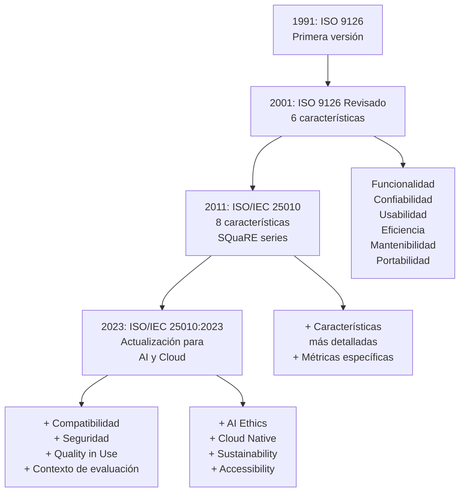
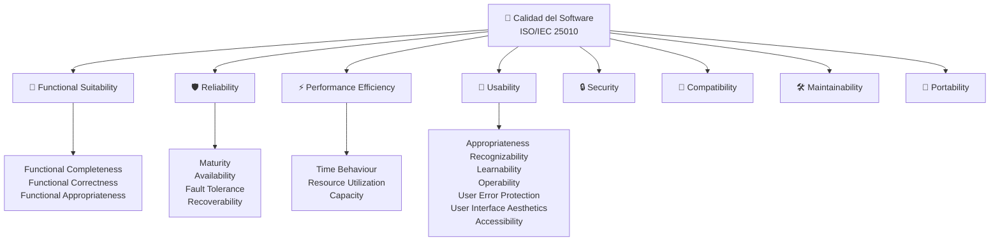
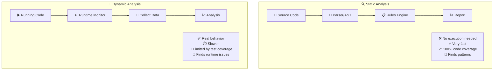
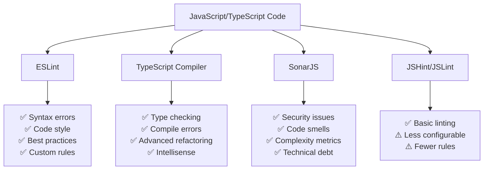
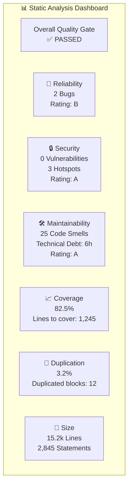
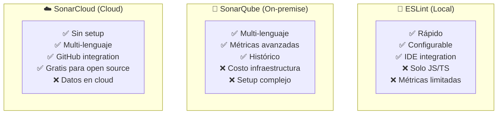
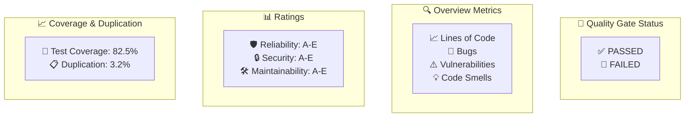

# Clase 02 - Semana 02 - Estándares ISO de calidad y Introducción a análisis estático con SonarQube y ESLint

- Unidad 01: **Calidad y Testing de Software**
- Fecha: Martes 19 de Agosto, 2025
- Horarios: 15:50 - 18:10
- Docente: Diego Obando

## 🎯 Objetivos de la Clase

Al finalizar la clase serás capaz de:

- Aplicar los estándares ISO/IEC 25010 para evaluar la calidad del software de manera sistemática.
- Configurar e implementar análisis estático usando ESLint en proyectos JavaScript/TypeScript.
- Integrar SonarCloud en proyectos para monitoreo continuo de calidad de código.
- Establecer quality gates basados en estándares internacionales de calidad.

---

## 📖 Contenidos

### BLOQUE 1: Estándares ISO de calidad de software (35 min)

### BLOQUE 2: Fundamentos de análisis estático (40 min)

### BLOQUE 3: ESLint hands-on (35 min)

### BLOQUE 4: SonarCloud introducción y práctica (30 min)

---

# 📏 BLOQUE 1: Estándares ISO de calidad de software (35 min)

_"Los estándares no limitan la creatividad, proporcionan el marco para que la creatividad sea efectiva y medible"_

## 📚 Glosario de Estándares de Calidad

Antes de profundizar, definamos los conceptos clave:

| Término/Acrónimo   | Definición                                                                                          | Ejemplo práctico                                                 |
| ------------------ | --------------------------------------------------------------------------------------------------- | ---------------------------------------------------------------- |
| **ISO**            | International Organization for Standardization - Organización que define estándares internacionales | Como las normas de calidad para autos, pero para software        |
| **IEC**            | International Electrotechnical Commission - Comisión que define estándares para tecnología          | Trabaja junto con ISO en estándares tecnológicos                 |
| **SQuaRE**         | Systems and software Quality Requirements and Evaluation                                            | Marco de trabajo de ISO para evaluar calidad de software         |
| **ISO/IEC 25010**  | Estándar específico que define las características de calidad del software                          | "El software debe ser funcional, confiable, usable..."           |
| **Quality Model**  | Modelo que organiza las características de calidad en una jerarquía                                 | Como un árbol: Calidad → Característica → Sub-característica     |
| **Quality in Use** | Calidad experimentada por usuarios en contexto real de uso                                          | ¿El software realmente ayuda al usuario a cumplir sus objetivos? |

## 🏛️ 1. Historia y contexto de los estándares ISO

### 1.1 ¿Por qué necesitamos estándares de calidad?

**🤔 Problema sin estándares:**

- Cada empresa define "calidad" a su manera
- No hay forma objetiva de comparar software
- Difícil comunicar requisitos de calidad
- Imposible medir progreso de manera consistente

**✅ Beneficios con estándares:**

- **Lenguaje común** para hablar de calidad
- **Métricas objetivas** y comparables
- **Mejores contratos** entre cliente-proveedor
- **Procesos repetibles** y auditables

### 1.2 Evolución de los estándares ISO para software



### 1.3 Conexión con DORA Metrics (Clase anterior)

> 💡 **Recordatorio:** Ayer vimos las métricas DORA que miden el **rendimiento** del equipo. Los estándares ISO miden la **calidad** del producto. ¡Ambos son complementarios!

| DORA Metrics (Proceso)   | ISO 25010 (Producto)        | Cómo se relacionan                                |
| ------------------------ | --------------------------- | ------------------------------------------------- |
| **Deployment Frequency** | **Reliability**             | Deploy frecuente requiere alta confiabilidad      |
| **Lead Time**            | **Maintainability**         | Código mantenible acelera development time        |
| **MTTR**                 | **Reliability + Usability** | Sistema confiable y usable se recupera más rápido |
| **Change Failure Rate**  | **Functional Suitability**  | Funcionalidad correcta = menos fallos             |

## 🏗️ 2. ISO/IEC 25010: El modelo de calidad moderno

### 2.1 Las 8 características principales



### 2.2 Explicación detallada con ejemplos prácticos

#### 🔧 1. Functional Suitability (Adecuación Funcional)

**¿Qué mide?** Qué tan bien el software cumple con las funciones requeridas.

| Sub-característica             | Definición                                      | Ejemplo en una app de banking                          |
| ------------------------------ | ----------------------------------------------- | ------------------------------------------------------ |
| **Functional Completeness**    | ¿Están todas las funciones necesarias?          | ✅ Transferir dinero, ✅ Ver saldo, ✅ Pagar servicios |
| **Functional Correctness**     | ¿Las funciones hacen lo correcto?               | Transferir $100 debe descontar exactamente $100        |
| **Functional Appropriateness** | ¿Las funciones son apropiadas para el objetivo? | No incluir juegos en una app bancaria seria            |

**📊 Cómo medirlo:**

```javascript
// Ejemplo de métricas para Functional Suitability
const functionalMetrics = {
  completeness: (implementedFunctions / requiredFunctions) * 100, // 95%
  correctness: (correctTestResults / totalTestResults) * 100, // 98%
  appropriateness: userSatisfactionScore, // 4.2/5
};
```

#### 🛡️ 2. Reliability (Fiabilidad)

**¿Qué mide?** Qué tan bien el software funciona sin fallar.

| Sub-característica  | Definición                                 | Ejemplo práctico                      |
| ------------------- | ------------------------------------------ | ------------------------------------- |
| **Maturity**        | Frecuencia de fallos por defectos          | Netflix tiene muy pocos crashes       |
| **Availability**    | % de tiempo que el sistema está disponible | "99.9% uptime"                        |
| **Fault Tolerance** | Capacidad de funcionar a pesar de fallos   | Si un servidor falla, otros continúan |
| **Recoverability**  | Capacidad de recuperarse tras fallos       | Auto-restart después de crash         |

**📊 Métricas concretas:**

```javascript
const reliabilityMetrics = {
  availability: 99.95, // %
  meanTimeBetweenFailures: 720, // horas
  meanTimeToRecovery: 15, // minutos
  errorRate: 0.01, // % de requests que fallan
};
```

#### ⚡ 3. Performance Efficiency (Eficiencia de Rendimiento)

**¿Qué mide?** Qué tan bien utiliza los recursos el software.

| Sub-característica       | Definición                | Ejemplo de medición                  |
| ------------------------ | ------------------------- | ------------------------------------ |
| **Time Behaviour**       | Tiempos de respuesta      | API responde en < 200ms              |
| **Resource Utilization** | Uso de CPU, memoria, red  | App usa < 100MB RAM                  |
| **Capacity**             | Máximo workload soportado | Soporta 10,000 usuarios concurrentes |

#### 👤 4. Usability (Usabilidad)

**¿Qué mide?** Qué tan fácil es usar el software.

**🧪 Ejemplo de evaluación de usabilidad:**

```markdown
## Test de Usabilidad - Registro de Usuario

### Scenario: Nuevo usuario se registra en la app

**Usuario:** María, 45 años, usa smartphone ocasionalmente

**Pasos:**

1. Abrir app
2. Encontrar botón "Registrarse"
3. Completar formulario
4. Confirmar registro

**Métricas:**

- ⏱️ Tiempo: 3 minutos (objetivo: < 5 min) ✅
- ❌ Errores: 1 (objetivo: < 2) ✅
- 😊 Satisfacción: 4/5 (objetivo: > 3.5) ✅
- 🎯 Éxito: Completó tarea ✅
```

#### 🔒 5. Security (Seguridad)

**¿Qué mide?** Protección de información y datos.

| Sub-característica  | Ejemplo en código              | Herramienta de medición    |
| ------------------- | ------------------------------ | -------------------------- |
| **Confidentiality** | Encriptación de contraseñas    | `bcrypt`, audit de accesos |
| **Integrity**       | Validación de datos de entrada | ESLint security rules      |
| **Non-repudiation** | Logs de transacciones          | Audit trails               |
| **Accountability**  | Trazabilidad de acciones       | User activity monitoring   |
| **Authenticity**    | Two-factor authentication      | Penetration testing        |

#### 🔄 6. Compatibility (Compatibilidad)

**¿Qué mide?** Capacidad de trabajar con otros sistemas.

**📱 Ejemplo práctico:**

```json
{
  "compatibility_matrix": {
    "browsers": {
      "chrome": "≥ 90",
      "firefox": "≥ 88",
      "safari": "≥ 14",
      "edge": "≥ 90"
    },
    "mobile_os": {
      "android": "≥ 8.0",
      "ios": "≥ 13.0"
    },
    "integrations": {
      "payment_gateways": ["stripe", "paypal"],
      "social_login": ["google", "facebook", "github"]
    }
  }
}
```

#### 🛠️ 7. Maintainability (Mantenibilidad)

**¿Qué mide?** Qué tan fácil es modificar el software.

**📊 Métricas de mantenibilidad:**

```javascript
// Ejemplo de métricas que SonarQube nos dará mañana
const maintainabilityMetrics = {
  cyclomaticComplexity: 8, // < 10 ✅
  duplicatedLines: 2.3, // < 3% ✅
  codeSmells: 15, // objetivo: < 20 ✅
  technicalDebt: "2h 30min", // tiempo estimado para corregir issues
  maintainabilityIndex: 75, // 0-100, >60 es bueno ✅
};
```

#### 📱 8. Portability (Portabilidad)

**¿Qué mide?** Facilidad de transferir el software a otros ambientes.

**🐳 Ejemplo con containerización:**

```dockerfile
# Dockerfile que mejora portabilidad
FROM node:18-alpine

# Funciona igual en dev, staging, production
WORKDIR /app
COPY package*.json ./
RUN npm ci --only=production

COPY . .
EXPOSE 3000

CMD ["npm", "start"]
```

## 🎯 3. Aplicación práctica: Evaluando un proyecto real

### 3.1 Checklist de calidad ISO 25010

**📋 Evaluación de una app web de e-commerce:**

| Característica             | Pregunta clave                         | Herramienta/Método       | ✅ Estado             |
| -------------------------- | -------------------------------------- | ------------------------ | --------------------- |
| **Functional Suitability** | ¿Puedo comprar productos exitosamente? | Testing funcional manual | ✅ Pasa               |
| **Reliability**            | ¿La app está disponible 24/7?          | Monitoring (Grafana)     | ⚠️ 98.5%              |
| **Performance**            | ¿Responde rápido bajo carga?           | k6 load testing          | ✅ <200ms             |
| **Usability**              | ¿Es fácil navegar y comprar?           | User testing             | ✅ 4.2/5              |
| **Security**               | ¿Están protegidos los datos?           | OWASP ZAP scan           | ❌ 3 vulnerabilidades |
| **Compatibility**          | ¿Funciona en todos los browsers?       | BrowserStack testing     | ✅ 95% cobertura      |
| **Maintainability**        | ¿Es fácil agregar features?            | SonarQube analysis       | ⚠️ Complejidad alta   |
| **Portability**            | ¿Se despliega fácil en cloud?          | Docker + K8s             | ✅ Containerizado     |

### 3.2 Conexión con Quality Gates (Clase anterior)

> 💡 **Recordatorio:** Ayer vimos Quality Gates como puntos de control. Ahora podemos definirlos basados en estándares ISO:

```yaml
# Quality Gate basado en ISO 25010
quality_gate_iso_25010:
  functional_suitability:
    test_coverage: "> 85%"
    acceptance_tests_pass: "100%"

  reliability:
    availability_target: "> 99.5%"
    error_rate: "< 0.1%"

  performance_efficiency:
    response_time_p95: "< 300ms"
    cpu_usage: "< 80%"

  security:
    critical_vulnerabilities: "= 0"
    high_vulnerabilities: "< 3"

  maintainability:
    cyclomatic_complexity: "< 10"
    code_duplication: "< 3%"
    technical_debt_ratio: "< 5%"
```

## 💡 Ejercicio Práctico (10 min)

**Escenario:** Evalúa una aplicación móvil de delivery de comida usando ISO 25010

**Aplicación:** "FoodFast" - App para pedir comida a domicilio

**Tarea en grupos (3-4 personas):**

1. **Selecciona 4 características** de ISO 25010 más críticas para esta app
2. **Define 2 métricas concretas** para cada característica seleccionada
3. **Propón 1 quality gate** específico para cada característica
4. **Identifica qué herramienta** usarías para medir cada métrica

**Tiempo:** 7 minutos de análisis + 3 minutos de presentación

**Ejemplo de formato:**

```
Característica: Performance Efficiency
Métricas:
  - Tiempo de búsqueda de restaurantes < 2 segundos
  - Tiempo de checkout < 30 segundos
Quality Gate: Si tiempo > umbral, bloquear deploy
Herramienta: k6 para load testing
```

---

## 🔚 Resumen BLOQUE 1

**Conceptos clave cubiertos:**
✅ Evolución e importancia de estándares ISO
✅ 8 características de ISO/IEC 25010 con ejemplos prácticos
✅ Conexión entre ISO 25010 y DORA Metrics
✅ Quality Gates basados en estándares internacionales
✅ Aplicación práctica en evaluación de proyectos

**Para el siguiente bloque:**
🎯 Análisis estático: La herramienta para medir automáticamente estas características

---

# 🔍 BLOQUE 2: Fundamentos de análisis estático (40 min)

_"El análisis estático es como tener un code reviewer que nunca se cansa, nunca se distrae y conoce todas las mejores prácticas"_

## 📚 Glosario de Análisis Estático

| Término/Concepto     | Definición                                                  | Ejemplo práctico                                               |
| -------------------- | ----------------------------------------------------------- | -------------------------------------------------------------- |
| **Static Analysis**  | Análisis de código sin ejecutarlo                           | Revisar código en busca de errores antes de correrlo           |
| **Dynamic Analysis** | Análisis de código mientras se ejecuta                      | Profiler que mide performance durante ejecución                |
| **Code Smell**       | Código que funciona pero indica problemas de diseño         | Función con 15 parámetros, clase con 2000 líneas               |
| **Linting**          | Proceso de análisis que busca errores de sintaxis y estilo  | ESLint que encuentra variables no usadas                       |
| **AST**              | Abstract Syntax Tree - Representación del código como árbol | Convertir `if (x > 0) { return true; }` en estructura de datos |
| **Rules Engine**     | Motor que aplica reglas predefinidas al código              | "No variables globales", "Máximo 10 líneas por función"        |
| **False Positive**   | Alerta de herramienta que no es realmente un problema       | Tool reporta "unused variable" pero sí se usa                  |
| **Technical Debt**   | Tiempo estimado para corregir todos los code smells         | "3h 45min para resolver todos los issues"                      |

## 🔬 1. ¿Qué es análisis estático vs dinámico?

### 1.1 Comparativa fundamental



### 1.2 Cuándo usar cada tipo

| Aspecto                     | Static Analysis    | Dynamic Analysis      | Ejemplo                              |
| --------------------------- | ------------------ | --------------------- | ------------------------------------ |
| **Cuándo en SDLC**          | Durante desarrollo | Durante testing       | Commit vs QA testing                 |
| **Velocidad**               | Segundos/minutos   | Minutos/horas         | ESLint vs load testing               |
| **Cobertura**               | Todo el código     | Solo código ejecutado | 100% vs coverage de tests            |
| **Problemas que encuentra** | Potenciales        | Reales en runtime     | Unused variable vs memory leak       |
| **Costo**                   | Muy bajo           | Medio-alto            | Gratis vs infraestructura de testing |

**💡 Ejemplo práctico:**

```javascript
// Código con problemas detectables por análisis estático
function calcularDescuento(precio, porcentaje) {
  let descuento; // ⚠️ Static: Variable declarada pero no usada inicialmente

  if (precio > 100) {
    descuento = precio * (porcentaje / 100);
    return precio - descuento;
  }
  // ⚠️ Static: Camino sin return (potential bug)
}

// Problemas detectables solo por análisis dinámico
function dividir(a, b) {
  return a / b; // ✅ Static: Sintaxis correcta
  // ❌ Dynamic: División por cero cuando b=0
}
```

## 🔧 2. Tipos de análisis estático

### 2.1 Por nivel de profundidad

#### 🟢 Nivel 1: Syntax y Linting

**¿Qué detecta?** Errores básicos de sintaxis y estilo

```javascript
// Problemas que detecta un linter básico
var unusedVariable = "hello"; // ⚠️ Variable no usada
function test() {
  console.log("test"); // ⚠️ Falta punto y coma
  if (true) {
    return "ok";
  }
  // ⚠️ Indentación inconsistente
}
```

#### 🟡 Nivel 2: Semantic Analysis

**¿Qué detecta?** Problemas de lógica y flujo

```javascript
// Problemas semánticos
function getUserData(userId) {
  if (userId == null) {
    return null;
  }

  // ⚠️ Código inalcanzable
  if (!userId) {
    throw new Error("Invalid user ID");
  }

  let userData = fetchUser(userId);
  // ⚠️ Posible null pointer si fetchUser retorna null
  return userData.name;
}
```

#### 🔴 Nivel 3: Deep Analysis

**¿Qué detecta?** Vulnerabilidades de seguridad, complejidad, patrones arquitectónicos

```javascript
// Problemas de seguridad detectables por análisis profundo
app.get("/user/:id", (req, res) => {
  // ⚠️ SQL Injection vulnerability
  const query = `SELECT * FROM users WHERE id = ${req.params.id}`;

  // ⚠️ No input validation
  db.query(query, (err, result) => {
    // ⚠️ Exposing sensitive data
    res.json(result);
  });
});
```

### 2.2 Por tipo de problemas detectados

#### 🐛 Code Quality Issues

| Tipo                | Descripción                                     | Ejemplo                    | Herramienta             |
| ------------------- | ----------------------------------------------- | -------------------------- | ----------------------- |
| **Code Smells**     | Código que funciona pero es difícil de mantener | Función con 50 líneas      | SonarQube               |
| **Duplicated Code** | Bloques de código repetidos                     | Copy-paste de funciones    | PMD, SonarQube          |
| **Complex Code**    | Código difícil de entender                      | Cyclomatic complexity > 10 | ESLint complexity rules |
| **Dead Code**       | Código que nunca se ejecuta                     | Funciones no referenciadas | Dead code elimination   |

#### 🔒 Security Issues

| Categoría            | Problemas detectados                       | Ejemplo de regla                         |
| -------------------- | ------------------------------------------ | ---------------------------------------- |
| **Injection**        | SQL, NoSQL, Command injection              | "No concatenar strings en queries SQL"   |
| **Authentication**   | Weak password policies, session management | "Passwords deben tener min 8 caracteres" |
| **Sensitive Data**   | Hardcoded secrets, data exposure           | "No API keys en código fuente"           |
| **Input Validation** | Missing validation, XSS                    | "Validar todos los inputs del usuario"   |

#### ⚡ Performance Issues

```javascript
// Ejemplos de problemas de performance detectables
class PerformanceIssues {
  // ⚠️ Inefficient loop
  findUser(users, targetId) {
    for (let i = 0; i < users.length; i++) {
      // O(n)
      for (let j = 0; j < users.length; j++) {
        // O(n²) - could be O(n)
        if (users[i].id === targetId) {
          return users[i];
        }
      }
    }
  }

  // ⚠️ Memory leak potential
  constructor() {
    setInterval(() => {
      this.data.push(new Date()); // Array crece infinitamente
    }, 1000);
  }
}
```

## 🛠️ 3. Herramientas de análisis estático por lenguaje

### 3.1 JavaScript/TypeScript Ecosystem



### 3.2 Configuración típica de herramientas

#### ESLint Configuration

```json
{
  "extends": [
    "eslint:recommended",
    "@typescript-eslint/recommended",
    "plugin:security/recommended"
  ],
  "rules": {
    "complexity": ["error", 10],
    "max-lines": ["error", 300],
    "max-params": ["error", 4],
    "no-console": "warn",
    "no-unused-vars": "error",
    "security/detect-sql-injection": "error"
  },
  "overrides": [
    {
      "files": ["*.test.js", "*.spec.js"],
      "rules": {
        "no-console": "off" // Permitir console.log en tests
      }
    }
  ]
}
```

#### SonarQube Quality Profile

```xml
<!-- sonar-project.properties -->
sonar.projectKey=my-project
sonar.sources=src
sonar.tests=src/__tests__
sonar.exclusions=**/node_modules/**,**/build/**

<!-- Quality Gate conditions -->
sonar.qualitygate.wait=true
sonar.coverage.exclusions=**/*.test.js
```

## 📊 4. Métricas y reportes de análisis estático

### 4.1 Métricas de complejidad

#### Cyclomatic Complexity

```javascript
// Ejemplo de cálculo de complejidad ciclomática
function calculateDiscount(user, product, quantity) {
  // +1 (base)
  if (user.isPremium) {
    // +1 (if)
    if (quantity > 10) {
      // +1 (nested if)
      return product.price * 0.8;
    } else if (quantity > 5) {
      // +1 (else if)
      return product.price * 0.9;
    }
  } else if (user.isEmployee) {
    // +1 (else if)
    return product.price * 0.85;
  }
  return product.price; // Complejidad total: 5
}
```

#### Technical Debt Calculation

```javascript
// SonarQube calcula technical debt así:
const technicalDebt = {
  codeSmells: 25,
  securityHotspots: 3,
  bugs: 2,

  // Tiempo estimado para corregir
  remediation: {
    codeSmells: "4h 30min", // 25 issues * promedio 11min each
    securityHotspots: "45min", // 3 issues * 15min each
    bugs: "1h 20min", // 2 bugs * 40min each
    total: "6h 35min",
  },
};
```

### 4.2 Dashboard típico de análisis estático



## 🎯 5. Integración en el workflow de desarrollo

### 5.1 Análisis estático en diferentes momentos

| Momento               | Herramienta                 | Objetivo              | Tiempo típico |
| --------------------- | --------------------------- | --------------------- | ------------- |
| **Durante escritura** | IDE extensions (ESLint)     | Feedback inmediato    | < 1 segundo   |
| **Pre-commit**        | Husky + lint-staged         | Evitar código malo    | 5-30 segundos |
| **Pull Request**      | GitHub Actions + SonarCloud | Review automatizado   | 1-5 minutos   |
| **CI Pipeline**       | Jenkins + SonarQube         | Quality gate          | 2-10 minutos  |
| **Nightly builds**    | Full analysis + reports     | Tendencias y métricas | 10-60 minutos |

### 5.2 Configuración de pre-commit hook

```bash
#!/bin/sh
# .husky/pre-commit

echo "🔍 Running static analysis..."

# Linting
npm run lint:fix
if [ $? -ne 0 ]; then
  echo "❌ ESLint found errors"
  exit 1
fi

# Type checking
npm run type-check
if [ $? -ne 0 ]; then
  echo "❌ TypeScript compilation failed"
  exit 1
fi

# Security scan
npm run security:check
if [ $? -ne 0 ]; then
  echo "❌ Security vulnerabilities found"
  exit 1
fi

echo "✅ Static analysis passed!"
```

## 💡 Ejercicio Práctico (10 min)

**Escenario:** Analiza este código JavaScript y identifica problemas detectables por análisis estático

```javascript
var API_KEY = "sk-1234567890abcdef"; // Hardcoded secret

function processUserData(users) {
  var result = [];
  var temp;

  for (var i = 0; i < users.length; i++) {
    if (users[i].age > 18) {
      if (users[i].status == "active") {
        if (users[i].premium == true) {
          if (users[i].country == "US") {
            if (users[i].verified) {
              temp = users[i].name.toUpperCase();
              result.push(temp);
            }
          }
        }
      }
    }
  }

  // SQL query construction
  var query = "SELECT * FROM orders WHERE user_id = " + users[0].id;

  return result;
}
```

**Tarea en grupos (3-4 personas):**

1. **Identifica 5 problemas** que detectaría análisis estático
2. **Clasifica cada problema** (Security, Code Quality, Performance, etc.)
3. **Propón la regla ESLint** que detectaría cada problema
4. **Reescribe la función** corrigiendo los issues encontrados

**Tiempo:** 7 minutos análisis + 3 minutos presentación

---

## 🔚 Resumen BLOQUE 2

**Conceptos clave cubiertos:**
✅ Diferencia entre análisis estático vs dinámico
✅ Niveles de análisis: syntax, semantic, deep analysis
✅ Tipos de problemas: code quality, security, performance
✅ Herramientas por lenguaje y configuración práctica
✅ Métricas de complejidad y technical debt
✅ Integración en workflow de desarrollo

**Para el siguiente bloque:**
🎯 ESLint hands-on: Configuración y práctica con proyecto real

---

# ⚙️ BLOQUE 3: ESLint hands-on (35 min)

_"La mejor forma de aprender ESLint es ensuciarse las manos con código real y ver cómo te guía hacia mejores prácticas"_

## 🛠️ Glosario de ESLint

| Término      | Definición                                            | Ejemplo práctico                                     |
| ------------ | ----------------------------------------------------- | ---------------------------------------------------- |
| **ESLint**   | Herramienta de linting para JavaScript/TypeScript     | Encuentra errores y problemas de estilo en tu código |
| **Rule**     | Regla específica que ESLint verifica                  | `no-unused-vars` - detecta variables no utilizadas   |
| **Config**   | Archivo de configuración que define reglas y settings | `.eslintrc.json` con tus reglas personalizadas       |
| **Plugin**   | Extensión que añade reglas adicionales a ESLint       | `@typescript-eslint/eslint-plugin` para TypeScript   |
| **Preset**   | Conjunto preconfigurado de reglas                     | `eslint:recommended` - reglas básicas recomendadas   |
| **Parser**   | Componente que analiza el código y crea AST           | `@typescript-eslint/parser` para TypeScript          |
| **Override** | Configuración específica para ciertos archivos        | Reglas diferentes para archivos de test              |
| **Severity** | Nivel de importancia de una regla                     | `error`, `warn`, `off`                               |

## 🚀 1. Configuración inicial de ESLint

### 1.1 Instalación paso a paso

**📦 Paso 1: Inicializar proyecto Node.js**

```bash
# Crear directorio del proyecto
mkdir eslint-demo
cd eslint-demo

# Inicializar package.json
npm init -y
```

**⚙️ Paso 2: Instalar ESLint**

```bash
# Instalación local (recomendado)
npm install --save-dev eslint

# Instalación global (opcional)
npm install -g eslint
```

**🎯 Paso 3: Configuración inicial interactiva**

```bash
# Configuración guiada
npx eslint --init

# Opciones que seleccionaremos en clase:
# ✅ To check syntax, find problems, and enforce code style
# ✅ JavaScript modules (import/export)
# ✅ None of these frameworks (o React si están usando)
# ✅ Yes (TypeScript si están usando)
# ✅ Browser + Node
# ✅ Use a popular style guide
# ✅ Standard/Airbnb/Google (elegiremos Standard)
# ✅ JSON
```

### 1.2 Estructura del archivo de configuración

```json
{
  "env": {
    "browser": true,
    "es2021": true,
    "node": true,
    "jest": true
  },
  "extends": ["eslint:recommended", "@typescript-eslint/recommended"],
  "parser": "@typescript-eslint/parser",
  "parserOptions": {
    "ecmaVersion": "latest",
    "sourceType": "module"
  },
  "plugins": ["@typescript-eslint", "security"],
  "rules": {
    // Reglas personalizadas que configuraremos
  }
}
```

**📝 Explicación de cada sección:**

- **env**: Define qué variables globales están disponibles (browser, node, jest)
- **extends**: Hereda configuraciones de otros presets
- **parser**: Especifica cómo parsear el código (especial para TypeScript)
- **parserOptions**: Opciones del parser (versión ES, tipo de módulos)
- **plugins**: Extensiones que añaden reglas adicionales
- **rules**: Reglas específicas y su configuración

## 📋 2. Configuración de reglas esenciales

### 2.1 Reglas de calidad de código

```json
{
  "rules": {
    // 🐛 Potential Errors
    "no-console": "warn", // Advertir sobre console.log
    "no-unused-vars": "error", // Error si hay variables no usadas
    "no-undef": "error", // Error si uso variable no definida
    "no-unreachable": "error", // Código inalcanzable

    // 🎨 Code Style
    "indent": ["error", 2], // Indentación de 2 espacios
    "quotes": ["error", "single"], // Comillas simples
    "semi": ["error", "always"], // Punto y coma obligatorio
    "comma-trailing": ["error", "always-multiline"],

    // 🧠 Best Practices
    "eqeqeq": ["error", "always"], // Usar === en lugar de ==
    "no-eval": "error", // Prohibir eval()
    "no-implied-eval": "error", // Prohibir eval() implícito
    "no-var": "error", // Usar let/const, no var
    "prefer-const": "error", // Preferir const cuando es posible

    // 📏 Complexity
    "complexity": ["error", 10], // Máximo 10 de complejidad ciclomática
    "max-lines": ["error", 300], // Máximo 300 líneas por archivo
    "max-params": ["error", 4], // Máximo 4 parámetros por función
    "max-depth": ["error", 4] // Máximo 4 niveles de anidación
  }
}
```

### 2.2 Reglas de seguridad

```json
{
  "plugins": ["security"],
  "extends": ["plugin:security/recommended"],
  "rules": {
    // 🔒 Security Rules
    "security/detect-sql-injection": "error",
    "security/detect-eval-with-expression": "error",
    "security/detect-non-literal-regexp": "warn",
    "security/detect-unsafe-regex": "error",
    "security/detect-buffer-noassert": "error",
    "security/detect-child-process": "warn",
    "security/detect-hardcoded-secrets": "error"
  }
}
```

### 2.3 Overrides para diferentes tipos de archivos

```json
{
  "overrides": [
    {
      "files": ["*.test.js", "*.spec.js", "**/__tests__/**/*.js"],
      "env": {
        "jest": true
      },
      "rules": {
        "no-console": "off", // Permitir console.log en tests
        "max-lines": ["error", 500], // Tests pueden ser más largos
        "complexity": ["error", 15] // Tests pueden ser más complejos
      }
    },
    {
      "files": ["*.config.js", "webpack.config.js"],
      "env": {
        "node": true
      },
      "rules": {
        "no-console": "off" // Permitir console en archivos de config
      }
    }
  ]
}
```

## 🧪 3. Lab práctico: Configurando ESLint en un proyecto

### 3.1 Creando el proyecto de ejemplo

**📁 Estructura del proyecto:**

```
eslint-demo/
├── src/
│   ├── index.js
│   ├── utils.js
│   └── __tests__/
│       └── utils.test.js
├── .eslintrc.json
├── .eslintignore
└── package.json
```

**📝 Código problemático para practicar:**

```javascript
// src/index.js - ANTES de ESLint
var API_KEY = "secret-key-123";

function calculateTotal(items, taxRate, discountPercent) {
  var total = 0;
  var tax;
  var discount;
  var finalTotal;

  if (items == null) return 0;

  for (var i = 0; i < items.length; i++) {
    if (items[i].price > 0) {
      if (items[i].active == true) {
        if (items[i].category == "premium") {
          if (items[i].stock > 0) {
            total += items[i].price * items[i].quantity;
          }
        } else {
          total += items[i].price * items[i].quantity;
        }
      }
    }
  }

  tax = total * taxRate;
  discount = total * (discountPercent / 100);
  finalTotal = total + tax - discount;

  console.log("Calculated total:", finalTotal);
  return finalTotal;
}

// Función no utilizada
function unusedFunction() {
  eval("console.log('unsafe code')");
}
```

### 3.2 Configuración del .eslintignore

```bash
# .eslintignore
node_modules/
dist/
build/
*.min.js
coverage/
.env
```

### 3.3 Scripts de npm para automatización

```json
{
  "scripts": {
    "lint": "eslint src/",
    "lint:fix": "eslint src/ --fix",
    "lint:check": "eslint src/ --max-warnings 0",
    "lint:report": "eslint src/ -f html -o eslint-report.html"
  }
}
```

## 🔧 4. Ejecutando ESLint y corrigiendo errores

### 4.1 Ejecución básica

```bash
# Ejecutar ESLint en directorio src
npx eslint src/

# Output esperado:
# /src/index.js
#   1:1   error  Unexpected var, use let or const instead  no-var
#   1:11  error  'API_KEY' is assigned a value but never used  no-unused-vars
#   3:1   error  Expected indentation of 2 spaces but found 0  indent
#   ...
```

### 4.2 Corrección automática vs manual

**⚡ Auto-fix (--fix flag):**

```bash
npx eslint src/ --fix

# Corrige automáticamente:
# - Indentación
# - Comillas simples vs dobles
# - Puntos y coma faltantes
# - Espaciado
```

**🛠️ Corrección manual necesaria:**

```javascript
// src/index.js - DESPUÉS de aplicar reglas ESLint
const API_KEY = process.env.API_KEY; // ✅ const + variable de entorno

function calculateTotal(items, taxRate, discountPercent) {
  // ✅ Validación temprana
  if (!items || items.length === 0) return 0;

  let total = 0;

  // ✅ Simplificar lógica anidada
  for (const item of items) {
    if (shouldIncludeItem(item)) {
      total += item.price * item.quantity;
    }
  }

  const tax = total * taxRate;
  const discount = total * (discountPercent / 100);
  const finalTotal = total + tax - discount;

  return finalTotal;
}

// ✅ Función auxiliar para reducir complejidad
function shouldIncludeItem(item) {
  return (
    item.price > 0 &&
    item.active === true &&
    (item.category === "premium" ? item.stock > 0 : true)
  );
}
```

### 4.3 Interpretando reportes de ESLint

```bash
# Reporte detallado con estadísticas
npx eslint src/ -f compact

# Output:
# /src/index.js: line 1, col 1, Error - Unexpected var, use let or const instead (no-var)
# /src/index.js: line 3, col 1, Error - Expected indentation of 2 spaces (indent)
#
# ✖ 12 problems (8 errors, 4 warnings)
# ✔ 8 errors and 0 warnings potentially fixable with the `--fix` option.
```

## 📊 5. Integración con IDE y herramientas

### 5.1 Configuración en VS Code

**🔌 Extensión recomendada:**

- **ESLint** (by Microsoft) - `dbaeumer.vscode-eslint`

**⚙️ Settings.json para VS Code:**

```json
{
  "editor.codeActionsOnSave": {
    "source.fixAll.eslint": true
  },
  "eslint.validate": [
    "javascript",
    "javascriptreact",
    "typescript",
    "typescriptreact"
  ],
  "eslint.format.enable": true,
  "editor.formatOnSave": false
}
```

### 5.2 Pre-commit hook con Husky

```bash
# Instalación
npm install --save-dev husky lint-staged

# Configuración en package.json
```

```json
{
  "husky": {
    "hooks": {
      "pre-commit": "lint-staged"
    }
  },
  "lint-staged": {
    "*.{js,ts}": ["eslint --fix", "git add"]
  }
}
```

### 5.3 CI/CD Integration

```yaml
# .github/workflows/lint.yml
name: ESLint Check

on: [push, pull_request]

jobs:
  lint:
    runs-on: ubuntu-latest

    steps:
      - uses: actions/checkout@v2

      - name: Setup Node.js
        uses: actions/setup-node@v2
        with:
          node-version: "18"

      - name: Install dependencies
        run: npm ci

      - name: Run ESLint
        run: npm run lint:check

      - name: Upload ESLint report
        if: failure()
        uses: actions/upload-artifact@v2
        with:
          name: eslint-report
          path: eslint-report.html
```

## 💡 Lab práctico en clase (20 min)

### Parte 1: Configuración inicial (10 min)

**👨‍💻 Actividad:**

1. **Crear proyecto nuevo**

   ```bash
   mkdir mi-eslint-lab
   cd mi-eslint-lab
   npm init -y
   ```

2. **Instalar y configurar ESLint**

   ```bash
   npm install --save-dev eslint
   npx eslint --init
   ```

3. **Crear código problemático** (usar el ejemplo de `calculateTotal`)

4. **Ejecutar ESLint** y ver los errores

### Parte 2: Corrección y personalización (10 min)

**🔧 Tareas:**

1. **Corregir 3 errores automáticamente** con `--fix`
2. **Corregir 3 errores manualmente**
3. **Personalizar una regla** en `.eslintrc.json`
4. **Agregar override** para archivos de test
5. **Configurar script** en `package.json`

**📋 Checklist de éxito:**

- [ ] ESLint ejecuta sin errores
- [ ] Código está formateado consistentemente
- [ ] Al menos una regla personalizada configurada
- [ ] Script de npm funciona correctamente

---

## 🔚 Resumen BLOQUE 3

**Conceptos clave cubiertos:**
✅ Instalación y configuración inicial de ESLint
✅ Configuración de reglas esenciales (calidad, seguridad, complejidad)
✅ Overrides para diferentes tipos de archivos
✅ Corrección automática vs manual de errores
✅ Integración con IDE, pre-commit hooks y CI/CD
✅ Lab práctico con proyecto real

**Para el siguiente bloque:**
🎯 SonarCloud: Análisis de calidad más profundo y métricas avanzadas

---

# ☁️ BLOQUE 4: SonarCloud introducción y práctica (30 min)

_"SonarCloud es como tener un experto senior en calidad de código revisando cada línea de tu proyecto 24/7"_

## 📚 Glosario de SonarCloud

| Término                    | Definición                                                         | Ejemplo práctico                                          |
| -------------------------- | ------------------------------------------------------------------ | --------------------------------------------------------- |
| **SonarCloud**             | Plataforma cloud de SonarSource para análisis de calidad de código | Version gratuita de SonarQube en la nube                  |
| **Quality Gate**           | Criterios que debe cumplir el código para "pasar" el análisis      | "Coverage > 80% AND Duplicated lines < 3%"                |
| **Code Smell**             | Problema de mantenibilidad en el código                            | Función muy larga, clase con demasiadas responsabilidades |
| **Technical Debt**         | Tiempo estimado para arreglar todos los issues del proyecto        | "8h 45min para resolver todos los code smells"            |
| **Hotspot**                | Código que requiere revisión manual de seguridad                   | Uso de APIs criptográficas, validación de input           |
| **Coverage**               | Porcentaje de código ejecutado por tests                           | 82.5% de líneas cubiertas por pruebas                     |
| **Duplication**            | Porcentaje de código duplicado en el proyecto                      | 3.2% de líneas están duplicadas                           |
| **Maintainability Rating** | Calificación A-E basada en technical debt ratio                    | A = < 5% technical debt, B = 6-10%, etc.                  |

## 🌐 1. SonarCloud vs SonarQube vs ESLint

### 1.1 Comparativa de herramientas



### 1.2 Cuándo usar cada herramienta

| Escenario                             | Herramienta recomendada | Razón                                 |
| ------------------------------------- | ----------------------- | ------------------------------------- |
| **Desarrollo local diario**           | ESLint + IDE            | Feedback inmediato                    |
| **Pull Request checks**               | SonarCloud              | Análisis completo sin infraestructura |
| **Enterprise con datos sensibles**    | SonarQube               | Control total de datos                |
| **Startup/proyecto pequeño**          | SonarCloud              | Costo-efectivo                        |
| **Multi-lenguaje (Java, C#, Python)** | SonarCloud/SonarQube    | ESLint solo JS/TS                     |

## 🚀 2. Configuración de SonarCloud paso a paso

### 2.1 Setup inicial (Demo en clase)

**📋 Paso 1: Crear cuenta en SonarCloud**

1. Ir a [sonarcloud.io](https://sonarcloud.io)
2. Login con GitHub account
3. Autorizar permisos para repos

**🔗 Paso 2: Conectar repositorio**

```bash
# En tu proyecto (continuando del lab ESLint)
git remote add origin https://github.com/tu-usuario/eslint-demo.git
git add .
git commit -m "Initial commit with ESLint config"
git push -u origin main
```

**⚙️ Paso 3: Configurar proyecto en SonarCloud**

1. Click "Analyze new project"
2. Seleccionar repositorio `eslint-demo`
3. Elegir método de análisis: **GitHub Actions** (recomendado)

### 2.2 Configuración del proyecto

**📄 Archivo sonar-project.properties:**

```properties
# Identificación del proyecto
sonar.projectKey=tu-usuario_eslint-demo
sonar.organization=tu-usuario

# Metadatos
sonar.projectName=ESLint Demo Project
sonar.projectVersion=1.0

# Directorios de código fuente
sonar.sources=src
sonar.tests=src/__tests__

# Exclusiones
sonar.exclusions=**/node_modules/**,**/coverage/**,**/dist/**
sonar.test.exclusions=**/*.test.js,**/*.spec.js

# Configuración de JavaScript/TypeScript
sonar.javascript.lcov.reportPaths=coverage/lcov.info
```

**🔄 GitHub Action para análisis automático:**

```yaml
# .github/workflows/sonar.yml
name: SonarCloud Analysis

on:
  push:
    branches: [main]
  pull_request:
    branches: [main]

jobs:
  sonarcloud:
    name: SonarCloud
    runs-on: ubuntu-latest

    steps:
      - uses: actions/checkout@v2
        with:
          fetch-depth: 0

      - name: Setup Node.js
        uses: actions/setup-node@v2
        with:
          node-version: "18"

      - name: Install dependencies
        run: npm ci

      - name: Run tests with coverage
        run: npm run test:coverage

      - name: Run ESLint
        run: npm run lint

      - name: SonarCloud Scan
        uses: SonarSource/sonarcloud-github-action@master
        env:
          GITHUB_TOKEN: ${{ secrets.GITHUB_TOKEN }}
          SONAR_TOKEN: ${{ secrets.SONAR_TOKEN }}
```

## 📊 3. Dashboard de SonarCloud: Interpretando métricas

### 3.1 Vista general del dashboard



### 3.2 Métricas detalladas explicadas

#### 🐛 Reliability (Bugs)

**¿Qué son?** Issues que representan errores en el código que pueden causar comportamiento inesperado.

```javascript
// Ejemplos de bugs que detecta SonarCloud
function processUsers(users) {
  // 🐛 Bug: Possible null pointer exception
  return users.map((user) => user.name.toUpperCase());
  //                           ^^^^
  // SonarCloud detecta: "user.name" podría ser null
}

function calculateAverage(numbers) {
  let sum = 0;
  // 🐛 Bug: División por cero
  for (let num of numbers) {
    sum += num;
  }
  return sum / numbers.length; // ¿Qué pasa si numbers está vacío?
}
```

#### 🔒 Security (Vulnerabilidades y Hotspots)

**Vulnerabilidades:** Issues con impacto de seguridad confirmado
**Hotspots:** Código sensible que requiere revisión manual

```javascript
// 🔴 Vulnerability: Hard-coded credentials
const API_KEY = "sk-1234567890abcdef";

// 🟡 Security Hotspot: SQL query construction
function getUser(userId) {
  // Hotspot: Posible SQL injection si no se valida userId
  const query = `SELECT * FROM users WHERE id = ${userId}`;
  return db.query(query);
}

// ✅ Solución segura
function getUserSecure(userId) {
  const query = "SELECT * FROM users WHERE id = ?";
  return db.query(query, [userId]); // Prepared statement
}
```

#### 💡 Maintainability (Code Smells)

**¿Qué son?** Issues que afectan la mantenibilidad del código.

```javascript
// 💡 Code Smell: Función demasiado compleja
function processOrder(order, customer, inventory, pricing, shipping) {
  // 🟡 Demasiados parámetros
  if (order && customer && inventory && pricing && shipping) {
    if (order.items && order.items.length > 0) {
      if (customer.verified === true) {
        if (inventory.inStock === true) {
          if (pricing.discount > 0) {
            if (shipping.available) {
              // ... 50+ líneas de lógica anidada
            }
          }
        }
      }
    }
  }
  // 💡 Code Smell: Complejidad ciclomática muy alta
  // 💡 Code Smell: Función muy larga (>25 líneas)
  // 💡 Code Smell: Anidación profunda (>4 niveles)
}
```

### 3.3 Quality Gates personalizados

```yaml
# Configuración de Quality Gate en SonarCloud UI
Quality Gate: "Sonar way"

Conditions:
  Coverage:
    - New Code Coverage > 80%
    - Overall Coverage > 70%

  Duplicated Lines:
    - New Code Duplicated Lines < 3%

  Maintainability:
    - New Code Maintainability Rating = A

  Reliability:
    - New Code Reliability Rating = A
    - New Code Bugs = 0

  Security:
    - New Code Security Rating = A
    - New Code Vulnerabilities = 0
```

## 🔧 4. Integración práctica con el proyecto ESLint

### 4.1 Agregando coverage con Jest

**📦 Instalación de dependencias de testing:**

```bash
# Agregar Jest para generar coverage
npm install --save-dev jest

# Configurar script en package.json
```

```json
{
  "scripts": {
    "test": "jest",
    "test:coverage": "jest --coverage",
    "test:watch": "jest --watch"
  },
  "jest": {
    "collectCoverageFrom": [
      "src/**/*.js",
      "!src/**/*.test.js",
      "!src/index.js"
    ],
    "coverageDirectory": "coverage",
    "coverageReporters": ["text", "lcov", "html"]
  }
}
```

**🧪 Test básico para generar coverage:**

```javascript
// src/__tests__/utils.test.js
const { shouldIncludeItem, calculateTotal } = require("../utils");

describe("shouldIncludeItem", () => {
  test("should include active premium item with stock", () => {
    const item = {
      price: 100,
      active: true,
      category: "premium",
      stock: 5,
    };

    expect(shouldIncludeItem(item)).toBe(true);
  });

  test("should exclude inactive item", () => {
    const item = {
      price: 100,
      active: false,
      category: "premium",
      stock: 5,
    };

    expect(shouldIncludeItem(item)).toBe(false);
  });
});

describe("calculateTotal", () => {
  test("should return 0 for empty items", () => {
    expect(calculateTotal([], 0.1, 10)).toBe(0);
  });

  test("should calculate total with tax and discount", () => {
    const items = [
      {
        price: 100,
        quantity: 2,
        active: true,
        category: "standard",
        stock: 10,
      },
    ];

    const result = calculateTotal(items, 0.1, 10);
    expect(result).toBe(200 + 20 - 20); // total + tax - discount = 200
  });
});
```

### 4.2 Workflow completo: ESLint → Jest → SonarCloud

```yaml
# .github/workflows/quality-check.yml
name: Code Quality Pipeline

on:
  push:
    branches: [main]
  pull_request:
    branches: [main]

jobs:
  quality-check:
    runs-on: ubuntu-latest

    steps:
      - uses: actions/checkout@v2
        with:
          fetch-depth: 0

      - name: Setup Node.js
        uses: actions/setup-node@v2
        with:
          node-version: "18"

      - name: Install dependencies
        run: npm ci

      # Paso 1: Linting con ESLint
      - name: Run ESLint
        run: npm run lint

      # Paso 2: Tests con coverage
      - name: Run tests with coverage
        run: npm run test:coverage

      # Paso 3: SonarCloud Analysis
      - name: SonarCloud Scan
        uses: SonarSource/sonarcloud-github-action@master
        env:
          GITHUB_TOKEN: ${{ secrets.GITHUB_TOKEN }}
          SONAR_TOKEN: ${{ secrets.SONAR_TOKEN }}

      # Paso 4: Comment PR con results (opcional)
      - name: Comment PR
        if: github.event_name == 'pull_request'
        uses: sonarcloud-quality-gate-action@master
        env:
          GITHUB_TOKEN: ${{ secrets.GITHUB_TOKEN }}
          SONAR_TOKEN: ${{ secrets.SONAR_TOKEN }}
```

## 📈 5. Analizando un proyecto real

### 5.1 Demo en vivo: Análisis de proyecto

**🔍 Durante la clase analizaremos:**

1. **Crear nuevo proyecto público en GitHub**
2. **Configurar SonarCloud** para el repositorio
3. **Ejecutar primer análisis** y revisar resultados
4. **Interpretar métricas** en el dashboard
5. **Configurar Quality Gate** personalizado
6. **Simular PR** con quality gate failure

### 5.2 Interpretación de resultados típicos

```
📊 Análisis Results - eslint-demo

🎯 Quality Gate: ❌ FAILED
   - Coverage: 65% (Required: 80%)
   - Duplicated Lines: 5.2% (Required: <3%)

📈 Overview:
   - Lines of Code: 247
   - Bugs: 2 🐛
   - Vulnerabilities: 1 🔒
   - Code Smells: 8 💡

📊 Ratings:
   - Reliability: C (2 bugs)
   - Security: B (1 vulnerability)
   - Maintainability: B (8 code smells)

🧪 Coverage: 65.4% (162/247 lines covered)
🔄 Duplication: 5.2% (13 duplicated blocks)
```

### 5.3 Plan de acción basado en resultados

| Issue               | Prioridad | Acción                      | Tiempo estimado |
| ------------------- | --------- | --------------------------- | --------------- |
| **1 Vulnerability** | 🔴 Alta   | Corregir hardcoded API key  | 15 min          |
| **2 Bugs**          | 🟡 Media  | Fix null pointer exceptions | 30 min          |
| **Coverage < 80%**  | 🟡 Media  | Escribir tests faltantes    | 45 min          |
| **8 Code Smells**   | 🟢 Baja   | Refactor gradual            | 2h 30min        |
| **Duplication**     | 🟢 Baja   | Extract common functions    | 45 min          |

## 💡 Actividad final (15 min)

### Configuración guiada de SonarCloud

**👨‍💻 Cada estudiante:**

1. **Fork del proyecto demo** (5 min)

   - Fork repositorio compartido
   - Configurar SonarCloud para su fork

2. **Análisis y corrección** (10 min)
   - Ejecutar primer análisis
   - Identificar top 3 issues más críticos
   - Corregir al menos 1 issue
   - Re-ejecutar análisis y verificar mejora

**🏆 Objetivo:** Ver Quality Gate pasar de FAILED a PASSED

---

## 🔚 Resumen BLOQUE 4

**Conceptos clave cubiertos:**
✅ SonarCloud vs SonarQube vs ESLint - cuándo usar cada uno
✅ Configuración completa de SonarCloud con GitHub Actions  
✅ Interpretación de métricas: bugs, vulnerabilities, code smells
✅ Quality Gates personalizados y criterios de calidad
✅ Integración completa: ESLint → Jest → SonarCloud
✅ Análisis de proyecto real y plan de acción

---

## 🎓 RESUMEN GENERAL DE LA CLASE

### 🔄 Recorrido completo:

**BLOQUE 1:** Estándares ISO/IEC 25010 - El marco teórico de calidad
**BLOQUE 2:** Análisis estático - Los fundamentos técnicos
**BLOQUE 3:** ESLint hands-on - Herramientas locales y desarrollo diario  
**BLOQUE 4:** SonarCloud - Análisis profundo y métricas avanzadas

### 🎯 Objetivos logrados:

✅ **Comprender estándares ISO** para evaluar calidad sistemáticamente
✅ **Configurar ESLint** para análisis estático local
✅ **Integrar SonarCloud** para monitoreo continuo de calidad
✅ **Establecer Quality Gates** basados en métricas objetivas

### 🛠️ Skills prácticos adquiridos:

- **Configuración** de herramientas de análisis estático
- **Interpretación** de métricas de calidad
- **Corrección** de issues detectados automáticamente
- **Integración** en pipelines de CI/CD
- **Establecimiento** de criterios de calidad objetivos

### 🚀 Para la próxima clase:

- **Análisis más profundo** de seguridad en código
- **Métricas avanzadas** de rendimiento
- **Testing automatizado** con coverage análisis
- **Quality gates** en proyectos reales

### 📚 Recursos para profundizar:

- **Documentación:** [SonarCloud Docs](https://sonarcloud.io/documentation), [ESLint Rules](https://eslint.org/docs/rules/)
- **Práctica:** Aplicar estas herramientas en proyectos personales
- **Comunidad:** [SonarSource Community](https://community.sonarsource.com/)

---

**¡Excelente trabajo! 🎉**

_"La calidad no es un acto, es un hábito. Ahora tienen las herramientas para hacer de la calidad de código un hábito diario."_

## 📖 Contenidos

BLOQUE 1: Estándares ISO de Calidad (35 min)

BLOQUE 2: Fundamentos de Análisis Estático (40 min)

BLOQUE 3: ESLint hands-on (35 min)

BLOQUE 4: SonarQube Introducción (30 min)
