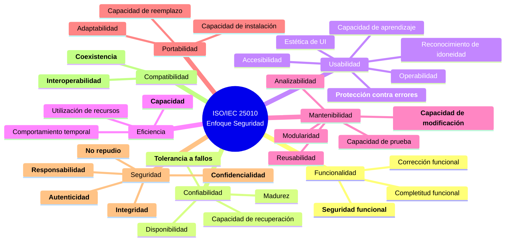
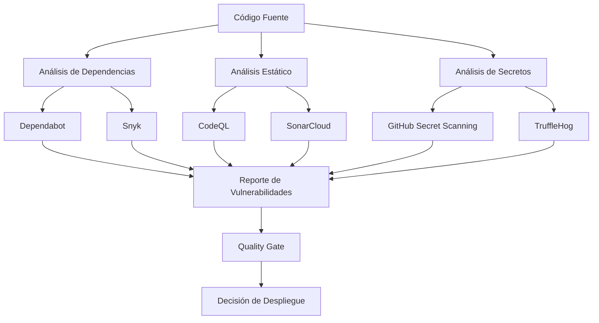
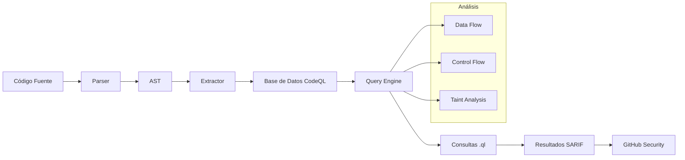
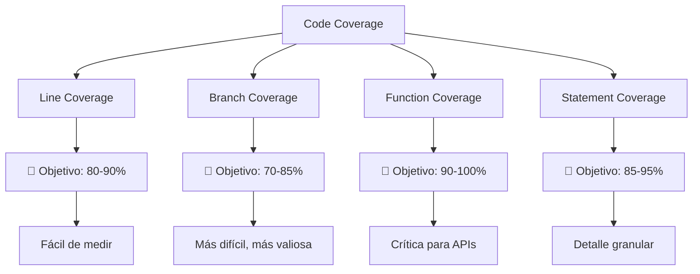
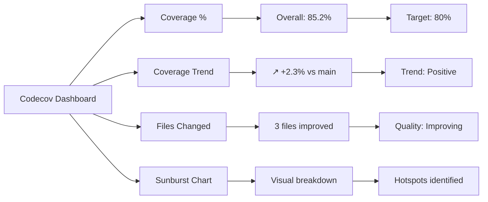
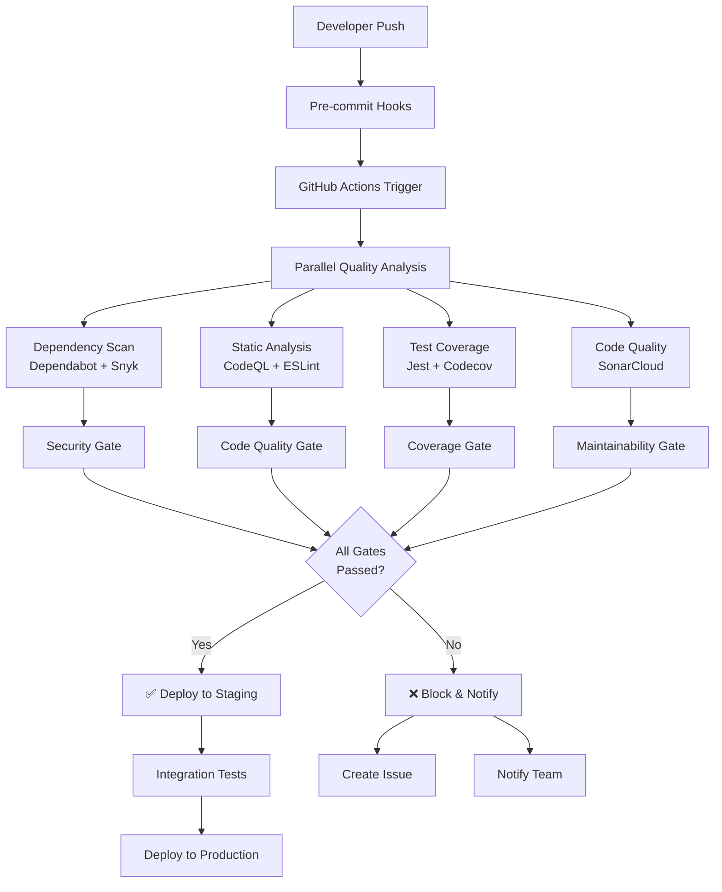

# Clase 03 - Semana 02: Pipeline de Calidad Integral y Herramientas de Seguridad

## 🎯 Objetivos de la Clase

Al finalizar la clase serás capaz de:

- Comprender las características de calidad del software según ISO/IEC 25010
- Implementar herramientas de análisis de seguridad (Dependabot, Snyk, CodeQL)
- Configurar Codecov para análisis de cobertura de código
- Crear un pipeline integral de calidad con múltiples herramientas
- Integrar todas las herramientas en un flujo de trabajo automatizado

---

## 📚 Estructura de la Clase (180 minutos)

### Bloque 1: Características de Calidad y Herramientas de Seguridad (45 minutos)

- **Duración:** 45 minutos
- **Modalidad:** Teórico-práctica
- **Objetivos específicos:**
  - Revisar y profundizar en las 8 características de ISO/IEC 25010
  - Conocer herramientas de análisis de seguridad
  - Configurar Dependabot y Snyk
  - Implementar análisis de vulnerabilidades

### Bloque 2: CodeQL y Análisis Estático de Seguridad (45 minutos)

- **Duración:** 45 minutos
- **Modalidad:** Práctica guiada
- **Objetivos específicos:**
  - Configurar GitHub CodeQL
  - Crear consultas personalizadas
  - Analizar reportes de seguridad
  - Integrar con el flujo de trabajo

### Bloque 3: Codecov y Métricas de Cobertura (45 minutos)

- **Duración:** 45 minutos
- **Modalidad:** Laboratorio práctico
- **Objetivos específicos:**
  - Configurar Codecov en proyecto
  - Establecer umbrales de cobertura
  - Crear reportes visuales
  - Integrar con PR reviews

### Bloque 4: Pipeline Integral de Calidad (45 minutos)

- **Duración:** 45 minutos
- **Modalidad:** Proyecto integrador
- **Objetivos específicos:**
  - Unificar todas las herramientas
  - Crear workflow completo de calidad
  - Configurar Quality Gates avanzados
  - Documentar pipeline de calidad

---

# Bloque 1: Características de Calidad y Herramientas de Seguridad

## 🎯 Objetivos del Bloque

- Profundizar en las características de calidad de ISO/IEC 25010
- Implementar herramientas de análisis de seguridad
- Configurar Dependabot para gestión de dependencias
- Integrar Snyk para análisis de vulnerabilidades

## 📖 Glosario

| Término                 | Definición                                                                                                |
| ----------------------- | --------------------------------------------------------------------------------------------------------- |
| **CVE**                 | Common Vulnerabilities and Exposures - Base de datos pública de vulnerabilidades de seguridad conocidas   |
| **CVSS**                | Common Vulnerability Scoring System - Sistema de puntuación para evaluar la severidad de vulnerabilidades |
| **Dependabot**          | Herramienta de GitHub que identifica y actualiza automáticamente dependencias vulnerables                 |
| **OWASP**               | Open Web Application Security Project - Organización que define las mejores prácticas de seguridad web    |
| **SAST**                | Static Application Security Testing - Análisis de seguridad estático del código fuente                    |
| **Snyk**                | Plataforma de seguridad que identifica y corrige vulnerabilidades en dependencias y código                |
| **Supply Chain Attack** | Ataque que compromete software mediante vulnerabilidades en la cadena de suministro                       |
| **Zero-day**            | Vulnerabilidad de seguridad no conocida públicamente y sin parche disponible                              |

## 1. Revisión de Características de Calidad ISO/IEC 25010

### 🔄 Repaso Interactivo

Recordemos las 8 características de calidad, pero ahora enfocándolas desde la perspectiva de **seguridad**:



### 📊 Matriz de Impacto de Seguridad

| Característica     | Impacto en Seguridad                | Herramientas de Medición |
| ------------------ | ----------------------------------- | ------------------------ |
| **Funcionalidad**  | Validación de entrada, autorización | Dependabot, Snyk         |
| **Confiabilidad**  | Disponibilidad del servicio         | CodeQL, monitoreo        |
| **Usabilidad**     | Prevención de errores humanos       | Análisis UX, pruebas     |
| **Eficiencia**     | Prevención de DoS                   | Pruebas de carga         |
| **Mantenibilidad** | Facilidad de aplicar parches        | Análisis estático        |
| **Portabilidad**   | Configuración segura                | Contenedores, IaC        |
| **Seguridad**      | Protección integral                 | SAST, DAST, SCA          |
| **Compatibilidad** | Integración sin vulnerabilidades    | Análisis de dependencias |

## 2. Introducción a las Herramientas de Seguridad

### 🛡️ Ecosistema de Herramientas



### 🔍 Tipos de Análisis de Seguridad

| Tipo     | Descripción                                                    | Herramientas       | Momento    |
| -------- | -------------------------------------------------------------- | ------------------ | ---------- |
| **SCA**  | Software Composition Analysis - Análisis de dependencias       | Dependabot, Snyk   | Build time |
| **SAST** | Static Application Security Testing - Código estático          | CodeQL, SonarCloud | Commit/PR  |
| **DAST** | Dynamic Application Security Testing - Aplicación en ejecución | OWASP ZAP, Burp    | Testing    |
| **IAST** | Interactive Application Security Testing - Híbrido             | Contrast, Veracode | Runtime    |

## 3. Configuración de Dependabot

### 🤖 ¿Qué es Dependabot?

**Dependabot** es una herramienta integrada en GitHub que:

- Escanea dependencias en busca de vulnerabilidades conocidas
- Crea automáticamente Pull Requests para actualizaciones
- Mantiene las dependencias actualizadas
- Proporciona información detallada sobre vulnerabilidades

### 📝 Configuración Básica

Crear archivo `.github/dependabot.yml`:

```yaml
# .github/dependabot.yml
version: 2
updates:
  # Habilitar actualizaciones de versión para npm
  - package-ecosystem: "npm"
    directory: "/"
    schedule:
      interval: "weekly"
      day: "monday"
      time: "09:00"
      timezone: "America/Santiago"
    # Límite de PRs abiertas
    open-pull-requests-limit: 10
    # Configuración de commits
    commit-message:
      prefix: "chore"
      prefix-development: "chore"
      include: "scope"
    # Revisar solo dependencias de producción
    ignore:
      - dependency-name: "eslint*"
        update-types: ["version-update:semver-major"]
    # Asignación automática
    assignees:
      - "team-lead"
    reviewers:
      - "security-team"
    labels:
      - "dependencies"
      - "security"

  # Configuración para GitHub Actions
  - package-ecosystem: "github-actions"
    directory: "/"
    schedule:
      interval: "weekly"
    commit-message:
      prefix: "ci"
      include: "scope"
    labels:
      - "ci-cd"
      - "security"

  # Configuración para Docker
  - package-ecosystem: "docker"
    directory: "/"
    schedule:
      interval: "weekly"
    commit-message:
      prefix: "docker"
```

### 🔧 Configuración Avanzada para Proyectos Específicos

#### Para proyectos Node.js con múltiples directorios:

```yaml
# Configuración para monorepo
version: 2
updates:
  # Frontend
  - package-ecosystem: "npm"
    directory: "/frontend"
    schedule:
      interval: "daily"
    target-branch: "develop"
    allow:
      - dependency-type: "direct"
      - dependency-type: "indirect"

  # Backend
  - package-ecosystem: "npm"
    directory: "/backend"
    schedule:
      interval: "daily"
    target-branch: "develop"

  # Shared components
  - package-ecosystem: "npm"
    directory: "/packages/shared"
    schedule:
      interval: "weekly"
```

### 🎯 Práctica Guiada: Configurar Dependabot

1. **Crear configuración básica:**

```bash
# Crear estructura de directorios
mkdir -p .github
```

2. **Crear archivo de configuración:**

```yaml
# .github/dependabot.yml - Configuración inicial
version: 2
updates:
  - package-ecosystem: "npm"
    directory: "/"
    schedule:
      interval: "weekly"
    labels:
      - "dependencies"
      - "security"
    commit-message:
      prefix: "deps"
```

3. **Verificar configuración en GitHub:**
   - Ir a Settings → Security & analysis
   - Verificar que Dependabot esté habilitado
   - Revisar alertas de seguridad

## 4. Implementación de Snyk

### 🔍 ¿Qué es Snyk?

**Snyk** es una plataforma de seguridad para desarrolladores que:

- Encuentra y corrige vulnerabilidades en dependencias
- Analiza código para problemas de seguridad
- Monitorea contenedores Docker
- Proporciona consejos de remediación

### 🛠️ Configuración de Snyk

#### 1. Configuración mediante GitHub Actions

```yaml
# .github/workflows/security.yml
name: Security Analysis

on:
  push:
    branches: [main, develop]
  pull_request:
    branches: [main]

jobs:
  security:
    runs-on: ubuntu-latest
    name: Run Snyk to check for vulnerabilities
    steps:
      - uses: actions/checkout@v4

      - name: Setup Node.js
        uses: actions/setup-node@v4
        with:
          node-version: "18"
          cache: "npm"

      - name: Install dependencies
        run: npm ci

      - name: Run Snyk to check for vulnerabilities
        uses: snyk/actions/node@master
        env:
          SNYK_TOKEN: ${{ secrets.SNYK_TOKEN }}
        with:
          args: --severity-threshold=medium

      - name: Upload result to GitHub Code Scanning
        uses: github/codeql-action/upload-sarif@v2
        with:
          sarif_file: snyk.sarif
```

#### 2. Configuración local de Snyk

```json
// .snyk - Archivo de configuración local
{
  "version": "v1.0.0",
  "ignore": {},
  "patch": {},
  "language-settings": {
    "javascript": {
      "ignoreDevDeps": false
    }
  }
}
```

### 📊 Análisis de Vulnerabilidades

#### Ejemplo de reporte Snyk:

```bash
# Comando para análisis local
npx snyk test

# Salida esperada:
# Testing /path/to/project...
#
# Organization: your-org
# Package manager: npm
# Target file: package.json
# Project name: my-project
# Open source: yes
# Project path: /path/to/project
#
# ✗ High severity vulnerability found in lodash
#   Path: lodash@4.17.15
#   Info: Prototype Pollution
#   Remediation: Upgrade to lodash@4.17.19
```

## 5. Laboratorio Práctico: Configuración Inicial

### 🧪 Ejercicio 1: Configurar Dependabot

**Objetivo:** Configurar Dependabot en un proyecto existente

**Pasos:**

1. **Crear archivo de configuración:**

```yaml
# .github/dependabot.yml
version: 2
updates:
  - package-ecosystem: "npm"
    directory: "/"
    schedule:
      interval: "weekly"
    labels:
      - "dependencies"
      - "automated-pr"
    commit-message:
      prefix: "chore(deps)"
    reviewers:
      - "tu-usuario-github"
```

2. **Verificar funcionamiento:**
   - Hacer commit y push
   - Ir a la pestaña "Security" del repositorio
   - Verificar que aparezcan alertas de Dependabot

### 🧪 Ejercicio 2: Análisis con Snyk

**Objetivo:** Identificar vulnerabilidades en dependencias

**Pasos:**

1. **Instalar Snyk CLI:**

```bash
npm install -g snyk
```

2. **Autenticar con Snyk:**

```bash
snyk auth
```

3. **Analizar proyecto:**

```bash
# Análisis completo
snyk test

# Análisis con umbral de severidad
snyk test --severity-threshold=medium

# Generar reporte JSON
snyk test --json > vulnerabilities.json
```

4. **Revisar y corregir vulnerabilidades:**

```bash
# Obtener sugerencias de corrección
snyk fix

# Aplicar parches automáticos (si están disponibles)
snyk protect
```

## 📋 Checklist del Bloque 1

- [ ] Repaso de características ISO/IEC 25010 enfocadas en seguridad
- [ ] Comprensión de tipos de análisis de seguridad (SCA, SAST, DAST, IAST)
- [ ] Configuración de Dependabot con archivo `.github/dependabot.yml`
- [ ] Instalación y configuración de Snyk
- [ ] Análisis de vulnerabilidades en proyecto existente
- [ ] Interpretación de reportes de seguridad

## 🚀 Preparación para el Siguiente Bloque

En el **Bloque 2** trabajaremos con:

- Configuración avanzada de GitHub CodeQL
- Creación de consultas personalizadas de seguridad
- Análisis de código estático automatizado
- Integración con el flujo de trabajo de desarrollo

**Material para revisar:**

- Documentación de CodeQL: https://codeql.github.com/
- OWASP Top 10: https://owasp.org/Top10/

---

# Bloque 2: CodeQL y Análisis Estático de Seguridad

## 🎯 Objetivos del Bloque

- Configurar GitHub CodeQL para análisis automático
- Comprender el funcionamiento de consultas CodeQL
- Crear consultas personalizadas para detectar vulnerabilidades
- Integrar CodeQL en el flujo de trabajo de desarrollo

## 📖 Glosario

| Término               | Definición                                                                                         |
| --------------------- | -------------------------------------------------------------------------------------------------- |
| **AST**               | Abstract Syntax Tree - Representación estructural del código fuente como un árbol                  |
| **CodeQL**            | Lenguaje de consultas de GitHub para analizar código en busca de vulnerabilidades                  |
| **SARIF**             | Static Analysis Results Interchange Format - Formato estándar para resultados de análisis estático |
| **Taint Analysis**    | Técnica que rastrea datos no confiables desde su origen hasta puntos sensibles                     |
| **Data Flow**         | Análisis que sigue el flujo de datos a través del programa                                         |
| **Control Flow**      | Análisis que examina todos los caminos de ejecución posibles                                       |
| **Semantic Analysis** | Análisis que comprende el significado del código, no solo su sintaxis                              |
| **Query Suite**       | Conjunto predefinido de consultas CodeQL organizadas por categorías                                |

## 1. Introducción a GitHub CodeQL

### 🔍 ¿Qué es CodeQL?

**CodeQL** es un motor de análisis semántico que trata el código como datos:

- Convierte el código fuente en una base de datos consultable
- Permite escribir consultas para encontrar patrones problemáticos
- Integra análisis de flujo de datos y control
- Soporta múltiples lenguajes (JavaScript, TypeScript, Python, Java, C#, Go, Ruby)

### 🏗️ Arquitectura de CodeQL



### 📊 Comparación de Herramientas de Análisis Estático

| Herramienta    | Tipo      | Lenguajes     | Análisis             | Integración   |
| -------------- | --------- | ------------- | -------------------- | ------------- |
| **CodeQL**     | SAST      | 8+ lenguajes  | Semántico, Data Flow | GitHub nativo |
| **SonarCloud** | SAST/DAST | 25+ lenguajes | Estático, Quality    | GitHub, otros |
| **ESLint**     | Linter    | JavaScript/TS | Sintáctico           | Configurable  |
| **Snyk Code**  | SAST      | 10+ lenguajes | ML-powered           | GitHub, IDE   |

## 2. Configuración de GitHub CodeQL

### 🛠️ Configuración Automática

GitHub CodeQL se puede habilitar automáticamente:

1. **Via GitHub UI:**

   - Ir a Settings → Security & analysis
   - Habilitar "Code scanning"
   - Seleccionar "Set up this workflow" en CodeQL

2. **Configuración manual con GitHub Actions:**

```yaml
# .github/workflows/codeql-analysis.yml
name: "CodeQL"

on:
  push:
    branches: [main, develop]
  pull_request:
    branches: [main]
  schedule:
    # Ejecutar análisis todas las semanas
    - cron: "30 2 * * 1"

jobs:
  analyze:
    name: Analyze
    runs-on: ubuntu-latest
    permissions:
      actions: read
      contents: read
      security-events: write

    strategy:
      fail-fast: false
      matrix:
        language: ["javascript", "python"]
        # Lenguajes soportados: 'cpp', 'csharp', 'go', 'java', 'javascript', 'python', 'ruby'

    steps:
      - name: Checkout repository
        uses: actions/checkout@v4

      - name: Initialize CodeQL
        uses: github/codeql-action/init@v2
        with:
          languages: ${{ matrix.language }}
          # Usar queries adicionales
          queries: security-extended,security-and-quality
          # Configurar packs personalizados
          packs: codeql/javascript-queries:AlertSuppression.ql

      - name: Autobuild
        uses: github/codeql-action/autobuild@v2

      - name: Perform CodeQL Analysis
        uses: github/codeql-action/analyze@v2
```

### 🔧 Configuración Avanzada

#### Configuración personalizada para proyectos específicos:

```yaml
# .github/workflows/codeql-custom.yml
name: "CodeQL Custom"

on:
  push:
    branches: [main]
    paths:
      - "**.js"
      - "**.ts"
      - "**.py"

jobs:
  analyze:
    name: Analyze Custom
    runs-on: ubuntu-latest

    steps:
      - uses: actions/checkout@v4

      - name: Initialize CodeQL
        uses: github/codeql-action/init@v2
        with:
          languages: javascript
          # Configuración personalizada
          config-file: ./.github/codeql/codeql-config.yml

      - name: Manual build for complex projects
        run: |
          npm ci
          npm run build

      - name: Perform CodeQL Analysis
        uses: github/codeql-action/analyze@v2
        with:
          category: "/language:javascript"
```

#### Archivo de configuración personalizada:

```yaml
# .github/codeql/codeql-config.yml
name: "Custom CodeQL Config"

# Disable default queries and use only custom ones
disable-default-queries: false

# Additional queries to run
queries:
  - name: security-extended
    uses: security-extended
  - name: security-and-quality
    uses: security-and-quality

# Custom query packs
packs:
  - codeql/javascript-queries
  - my-org/custom-security-queries

# Paths to ignore
paths-ignore:
  - "node_modules/**"
  - "dist/**"
  - "coverage/**"
  - "**/*.test.js"

# Paths to include (overrides paths-ignore)
paths:
  - "src/**"
  - "lib/**"
```

## 3. Consultas CodeQL Fundamentales

### 📝 Sintaxis Básica de CodeQL

CodeQL utiliza una sintaxis similar a SQL pero orientada a objetos:

```ql
// Consulta básica: Encontrar todas las funciones
import javascript

from Function f
select f, "Esta es una función"
```

### 🔍 Ejemplos de Consultas de Seguridad

#### 1. Detección de XSS (Cross-Site Scripting)

```ql
/**
 * @name Potential XSS vulnerability
 * @description User input flows to DOM without sanitization
 * @kind path-problem
 * @problem.severity error
 * @security-severity 6.1
 * @precision high
 * @id js/xss
 * @tags security
 *       external/cwe/cwe-079
 */

import javascript
import semmle.javascript.security.dataflow.XssQuery
import DataFlow::PathGraph

from Configuration cfg, DataFlow::PathNode source, DataFlow::PathNode sink
where cfg.hasFlowPath(source, sink)
select sink.getNode(), source, sink, "Cross-site scripting vulnerability due to $@.",
  source.getNode(), "user-provided value"
```

#### 2. Detección de SQL Injection

```ql
/**
 * @name SQL injection
 * @description Building SQL queries from user input may allow SQL injection
 * @kind path-problem
 * @problem.severity error
 * @security-severity 8.8
 * @precision high
 * @id js/sql-injection
 * @tags security
 *       external/cwe/cwe-089
 */

import javascript
import semmle.javascript.security.dataflow.SqlInjectionQuery
import DataFlow::PathGraph

from Configuration cfg, DataFlow::PathNode source, DataFlow::PathNode sink
where cfg.hasFlowPath(source, sink)
select sink.getNode(), source, sink, "This query depends on a $@.",
  source.getNode(), "user-provided value"
```

#### 3. Detección de Secretos Hardcodeados

```ql
/**
 * @name Hard-coded credentials
 * @description Hard-coding credentials in source code may allow unauthorized access
 * @kind problem
 * @problem.severity error
 * @security-severity 7.5
 * @precision medium
 * @id js/hardcoded-credentials
 * @tags security
 *       external/cwe/cwe-798
 */

import javascript

from StringLiteral str
where
  str.getValue().regexpMatch("(?i).*(password|secret|key|token).*=.*['\"][^'\"]{8,}['\"].*") and
  not str.getFile().getBaseName() = "test.js"
select str, "Hard-coded credential found in source code"
```

## 4. Laboratorio Práctico: Implementación de CodeQL

### 🧪 Ejercicio 1: Configuración Básica

**Objetivo:** Configurar CodeQL en un repositorio

**Pasos:**

1. **Crear workflow básico:**

```yaml
# .github/workflows/codeql-basic.yml
name: "CodeQL Basic"

on:
  push:
    branches: [main]
  pull_request:
    branches: [main]

jobs:
  analyze:
    name: Analyze
    runs-on: ubuntu-latest

    permissions:
      actions: read
      contents: read
      security-events: write

    steps:
      - name: Checkout repository
        uses: actions/checkout@v4

      - name: Initialize CodeQL
        uses: github/codeql-action/init@v2
        with:
          languages: javascript
          queries: security-and-quality

      - name: Autobuild
        uses: github/codeql-action/autobuild@v2

      - name: Perform CodeQL Analysis
        uses: github/codeql-action/analyze@v2
```

2. **Crear código vulnerable para testing:**

```javascript
// vulnerable-code.js
const express = require("express");
const mysql = require("mysql");
const app = express();

// SQL Injection vulnerability
app.get("/user/:id", (req, res) => {
  const userId = req.params.id;
  const query = `SELECT * FROM users WHERE id = ${userId}`; // Vulnerable!

  connection.query(query, (error, results) => {
    res.json(results);
  });
});

// XSS vulnerability
app.get("/search", (req, res) => {
  const searchTerm = req.query.q;
  res.send(`<h1>Results for: ${searchTerm}</h1>`); // Vulnerable!
});

// Hardcoded secret
const API_KEY = "sk-1234567890abcdef"; // Vulnerable!
```

### 🧪 Ejercicio 2: Consulta Personalizada

**Objetivo:** Crear una consulta CodeQL personalizada

**Pasos:**

1. **Crear directorio para consultas:**

```bash
mkdir -p .github/codeql-queries
```

2. **Crear consulta personalizada:**

```ql
// .github/codeql-queries/unsafe-eval.ql
/**
 * @name Use of eval
 * @description Using eval() can lead to code injection vulnerabilities
 * @kind problem
 * @problem.severity warning
 * @precision medium
 * @id js/unsafe-eval
 * @tags security
 *       maintainability
 */

import javascript

from CallExpr call
where call.getCalleeName() = "eval"
select call, "Use of eval() detected - consider safer alternatives"
```

3. **Integrar consulta en workflow:**

```yaml
- name: Initialize CodeQL
  uses: github/codeql-action/init@v2
  with:
    languages: javascript
    queries: ./github/codeql-queries/unsafe-eval.ql
```

### 🧪 Ejercicio 3: Análisis de Resultados

**Objetivo:** Interpretar y actuar sobre resultados de CodeQL

1. **Revisar resultados en GitHub:**

   - Ir a Security → Code scanning alerts
   - Analizar cada alerta encontrada
   - Clasificar por severidad

2. **Crear issue de seguimiento:**

````markdown
## 🚨 CodeQL Security Alert

**Tipo:** SQL Injection  
**Archivo:** `src/api/users.js`  
**Línea:** 15  
**Severidad:** High

### Descripción

Se detectó una potencial vulnerabilidad de SQL injection en el endpoint `/user/:id`.

### Código Problemático

```javascript
const query = `SELECT * FROM users WHERE id = ${userId}`;
```

### Solución Recomendada

Usar consultas parametrizadas:

```javascript
const query = "SELECT * FROM users WHERE id = ?";
connection.query(query, [userId], callback);
```

### Tareas

- [ ] Revisar código afectado
- [ ] Implementar solución
- [ ] Agregar tests de seguridad
- [ ] Verificar con CodeQL
````

## 5. Integración Avanzada

### 🔄 Pipeline Completo de Seguridad

```yaml
# .github/workflows/security-pipeline.yml
name: "Security Pipeline"

on:
  push:
    branches: [main, develop]
  pull_request:
    branches: [main]

jobs:
  security-analysis:
    runs-on: ubuntu-latest
    name: Multi-Tool Security Analysis

    steps:
      - uses: actions/checkout@v4

      # Dependabot-style dependency check
      - name: Run dependency check
        run: npm audit --audit-level moderate

      # Snyk vulnerability scanning
      - name: Run Snyk
        uses: snyk/actions/node@master
        env:
          SNYK_TOKEN: ${{ secrets.SNYK_TOKEN }}

      # CodeQL analysis
      - name: Initialize CodeQL
        uses: github/codeql-action/init@v2
        with:
          languages: javascript
          queries: security-extended,security-and-quality

      - name: Autobuild
        uses: github/codeql-action/autobuild@v2

      - name: Perform CodeQL Analysis
        uses: github/codeql-action/analyze@v2

      # Combine results
      - name: Security Report
        run: |
          echo "🔒 Security Analysis Complete"
          echo "📊 Check Security tab for detailed results"
```

## 📋 Checklist del Bloque 2

- [ ] Comprensión de la arquitectura CodeQL
- [ ] Configuración de GitHub CodeQL básica y avanzada
- [ ] Creación de consultas personalizadas de seguridad
- [ ] Análisis de vulnerabilidades comunes (XSS, SQL injection, secretos)
- [ ] Interpretación de resultados SARIF
- [ ] Integración con otros tools de seguridad
- [ ] Configuración de alertas y seguimiento

## 🚀 Preparación para el Siguiente Bloque

En el **Bloque 3** trabajaremos con:

- Configuración completa de Codecov
- Métricas avanzadas de cobertura de código
- Integración con Pull Request reviews
- Configuración de umbrales y Quality Gates de cobertura

**Material para revisar:**

- Documentación de Codecov: https://docs.codecov.io/
- Mejores prácticas de cobertura de código

---

# Bloque 3: Codecov y Métricas de Cobertura

## 🎯 Objetivos del Bloque

- Comprender la importancia de la cobertura de código en calidad de software
- Configurar Codecov para seguimiento de métricas de cobertura
- Implementar umbrales y Quality Gates basados en cobertura
- Integrar reportes de cobertura con Pull Request reviews

## 📖 Glosario

| Término                | Definición                                                                   |
| ---------------------- | ---------------------------------------------------------------------------- |
| **Code Coverage**      | Métrica que mide qué porcentaje del código es ejecutado por las pruebas      |
| **Branch Coverage**    | Porcentaje de ramas de decisión (if/else, switch) ejecutadas por las pruebas |
| **Line Coverage**      | Porcentaje de líneas de código ejecutadas por las pruebas                    |
| **Function Coverage**  | Porcentaje de funciones llamadas durante la ejecución de pruebas             |
| **Statement Coverage** | Porcentaje de declaraciones de código ejecutadas por las pruebas             |
| **Codecov**            | Plataforma que analiza y reporta métricas de cobertura de código             |
| **Coverage Delta**     | Diferencia en cobertura entre commits o branches                             |
| **Sunburst Chart**     | Visualización circular que muestra cobertura por directorios y archivos      |

## 1. Fundamentos de Cobertura de Código

### 📊 Tipos de Cobertura



### 📈 Relación Cobertura vs. Calidad

| % Cobertura | Calidad       | Descripción            | Acción Recomendada                 |
| ----------- | ------------- | ---------------------- | ---------------------------------- |
| **0-30%**   | 🔴 Crítica    | Cobertura insuficiente | Implementar pruebas básicas        |
| **30-60%**  | 🟡 Baja       | Cobertura básica       | Aumentar coverage sistemáticamente |
| **60-80%**  | 🟢 Buena      | Cobertura aceptable    | Enfocarse en casos críticos        |
| **80-95%**  | 🟢 Excelente  | Cobertura alta         | Mantener y optimizar               |
| **95-100%** | ⚠️ Precaución | Posible sobre-testing  | Evaluar costo vs beneficio         |

### 🎯 Mejores Prácticas de Cobertura

```javascript
// ❌ Malo: Coverage sin calidad
function add(a, b) {
  return a + b;
}

// Test que sube coverage pero no asegura calidad
test("add function", () => {
  add(1, 2); // No verifica el resultado
});

// ✅ Bueno: Coverage con calidad
test("add function should return correct sum", () => {
  expect(add(1, 2)).toBe(3);
  expect(add(-1, 1)).toBe(0);
  expect(add(0.1, 0.2)).toBeCloseTo(0.3);
});
```

## 2. Configuración de Codecov

### 🛠️ Setup Inicial de Codecov

#### 1. Registro y Configuración

1. **Registrarse en Codecov:**

   - Ir a https://codecov.io/
   - Conectar con GitHub
   - Seleccionar repositorios

2. **Obtener token de Codecov:**
   - En el dashboard de Codecov, ir a Settings
   - Copiar el token del repositorio
   - Agregarlo como secret en GitHub: `CODECOV_TOKEN`

#### 2. Configuración Básica con GitHub Actions

```yaml
# .github/workflows/coverage.yml
name: Coverage Analysis

on:
  push:
    branches: [main, develop]
  pull_request:
    branches: [main]

jobs:
  coverage:
    runs-on: ubuntu-latest

    steps:
      - name: Checkout code
        uses: actions/checkout@v4

      - name: Setup Node.js
        uses: actions/setup-node@v4
        with:
          node-version: "18"
          cache: "npm"

      - name: Install dependencies
        run: npm ci

      - name: Run tests with coverage
        run: npm run test:coverage

      - name: Upload coverage to Codecov
        uses: codecov/codecov-action@v3
        with:
          token: ${{ secrets.CODECOV_TOKEN }}
          files: ./coverage/lcov.info
          flags: unittests
          name: codecov-umbrella
          fail_ci_if_error: true
          verbose: true
```

#### 3. Configuración de Jest para Coverage

```json
// package.json
{
  "scripts": {
    "test": "jest",
    "test:coverage": "jest --coverage",
    "test:watch": "jest --watch",
    "test:coverage:watch": "jest --coverage --watch"
  },
  "jest": {
    "collectCoverage": true,
    "collectCoverageFrom": [
      "src/**/*.{js,ts}",
      "!src/**/*.test.{js,ts}",
      "!src/**/*.spec.{js,ts}",
      "!src/index.js",
      "!**/node_modules/**",
      "!**/coverage/**"
    ],
    "coverageThreshold": {
      "global": {
        "branches": 75,
        "functions": 80,
        "lines": 80,
        "statements": 80
      },
      "src/utils/": {
        "branches": 90,
        "functions": 95,
        "lines": 95,
        "statements": 95
      }
    },
    "coverageReporters": ["text", "text-summary", "html", "lcov"]
  }
}
```

### 📋 Configuración Avanzada de Codecov

#### Archivo de configuración `.codecov.yml`:

```yaml
# .codecov.yml
codecov:
  require_ci_to_pass: yes
  notify:
    wait_for_ci: yes

coverage:
  precision: 2
  round: down
  range: "70...100"

  status:
    project:
      default:
        target: 80%
        threshold: 1%
        if_no_uploads: error
        if_not_found: success
        if_ci_failed: error
        only_pulls: false

    patch:
      default:
        target: 75%
        threshold: 5%
        if_no_uploads: error
        if_not_found: success
        if_ci_failed: error
        only_pulls: true

    changes:
      default:
        if_no_uploads: error
        if_not_found: success
        if_ci_failed: error

# Comentarios en Pull Requests
comment:
  layout: "reach,diff,flags,tree,reach"
  behavior: default
  require_changes: false
  require_base: no
  require_head: yes
  branches:
    - "main"
    - "develop"

# Ignorar archivos específicos
ignore:
  - "docs/**/*"
  - "**/*.md"
  - "scripts/**/*"
  - "**/tests/**/*"
  - "**/*.config.js"
  - "webpack.config.js"
  - "jest.config.js"

# Configuración de flags para diferentes partes del código
flags:
  frontend:
    paths:
      - src/components/
      - src/pages/
  backend:
    paths:
      - src/api/
      - src/services/
  utils:
    paths:
      - src/utils/
      - src/helpers/
```

## 3. Métricas Avanzadas y Análisis

### 📊 Dashboard y Reportes

#### Interpretación del Dashboard de Codecov:



#### Análisis de Coverage Delta:

```yaml
# Ejemplo de reporte de Codecov en PR
# Coverage Report Summary
Coverage: 87.45% (+1.23%) compared to main
Files changed coverage: 91.2%

## Files with coverage changes:
| File | Coverage | Change |
|------|----------|--------|
| src/api/users.js | 95.2% | +5.2% |
| src/utils/validation.js | 78.3% | -2.1% |
| src/components/Button.js | 100% | New file |

## Missing coverage:
- src/utils/validation.js: Lines 45-52 (error handling)
- src/api/users.js: Line 23 (edge case)
```

### 🎯 Quality Gates Basados en Cobertura

#### Configuración de umbrales progresivos:

```yaml
# .codecov.yml - Configuración de Quality Gates
coverage:
  status:
    project:
      # Quality Gate principal
      main:
        target: 80%
        threshold: 2%
        if_no_uploads: error

      # Quality Gate para código crítico
      critical:
        target: 95%
        threshold: 1%
        paths:
          - "src/security/"
          - "src/payment/"
        if_no_uploads: error

      # Quality Gate para código nuevo
      new_code:
        target: 85%
        threshold: 0%
        only_pulls: true
        paths:
          - "src/"
        if_no_uploads: error

    patch:
      # Cobertura en cambios del PR
      default:
        target: 75%
        threshold: 10%
        only_pulls: true

      # Cobertura estricta para funciones críticas
      strict:
        target: 95%
        threshold: 0%
        paths:
          - "src/auth/"
          - "src/api/sensitive/"
```

## 4. Laboratorio Práctico: Implementación Completa

### 🧪 Ejercicio 1: Setup Básico de Codecov

**Objetivo:** Configurar Codecov en un proyecto existente

**Pasos:**

1. **Configurar Jest con coverage:**

```javascript
// jest.config.js
module.exports = {
  testEnvironment: "node",
  collectCoverage: true,
  collectCoverageFrom: ["src/**/*.js", "!src/**/*.test.js", "!src/index.js"],
  coverageReporters: ["text", "lcov", "html"],
  coverageThreshold: {
    global: {
      branches: 70,
      functions: 70,
      lines: 70,
      statements: 70,
    },
  },
};
```

2. **Crear código de ejemplo con diferentes niveles de cobertura:**

```javascript
// src/calculator.js
class Calculator {
  add(a, b) {
    return a + b;
  }

  subtract(a, b) {
    return a - b;
  }

  multiply(a, b) {
    return a * b;
  }

  divide(a, b) {
    if (b === 0) {
      throw new Error("Division by zero");
    }
    return a / b;
  }

  // Función sin cobertura intencionalmente
  advancedOperation(a, b, operation) {
    switch (operation) {
      case "power":
        return Math.pow(a, b);
      case "sqrt":
        return Math.sqrt(a);
      case "log":
        return Math.log(a);
      default:
        return 0;
    }
  }
}

module.exports = Calculator;
```

3. **Crear tests con cobertura parcial:**

```javascript
// src/calculator.test.js
const Calculator = require("./calculator");

describe("Calculator", () => {
  let calculator;

  beforeEach(() => {
    calculator = new Calculator();
  });

  test("should add two numbers correctly", () => {
    expect(calculator.add(2, 3)).toBe(5);
    expect(calculator.add(-1, 1)).toBe(0);
  });

  test("should subtract two numbers correctly", () => {
    expect(calculator.subtract(5, 3)).toBe(2);
  });

  test("should multiply two numbers correctly", () => {
    expect(calculator.multiply(3, 4)).toBe(12);
  });

  test("should divide two numbers correctly", () => {
    expect(calculator.divide(8, 2)).toBe(4);
  });

  test("should throw error when dividing by zero", () => {
    expect(() => calculator.divide(5, 0)).toThrow("Division by zero");
  });

  // Nota: advancedOperation no tiene tests intencionalmente
  // para mostrar falta de cobertura
});
```

### 🧪 Ejercicio 2: Análisis de Cobertura

**Objetivo:** Analizar reportes de cobertura y identificar áreas de mejora

**Pasos:**

1. **Ejecutar análisis de cobertura:**

```bash
npm run test:coverage
```

2. **Interpretar reporte de consola:**

```bash
# Salida esperada:
----------------------|---------|----------|---------|---------|-------------------
File                  | % Stmts | % Branch | % Funcs | % Lines | Uncovered Line #s
----------------------|---------|----------|---------|---------|-------------------
All files             |   85.71 |    66.67 |   83.33 |   85.71 |
 calculator.js        |   85.71 |    66.67 |   83.33 |   85.71 | 25,27,29,31
----------------------|---------|----------|---------|---------|-------------------
```

3. **Revisar reporte HTML:**
   - Abrir `coverage/lcov-report/index.html`
   - Identificar líneas no cubiertas
   - Analizar complejidad de branches

### 🧪 Ejercicio 3: Mejora de Cobertura

**Objetivo:** Incrementar cobertura mediante tests adicionales

**Pasos:**

1. **Agregar tests para funciones no cubiertas:**

```javascript
// Agregar al archivo calculator.test.js
describe("Advanced Operations", () => {
  test("should calculate power correctly", () => {
    expect(calculator.advancedOperation(2, 3, "power")).toBe(8);
  });

  test("should calculate square root correctly", () => {
    expect(calculator.advancedOperation(9, 0, "sqrt")).toBe(3);
  });

  test("should calculate logarithm correctly", () => {
    expect(calculator.advancedOperation(Math.E, 0, "log")).toBeCloseTo(1);
  });

  test("should return 0 for unknown operation", () => {
    expect(calculator.advancedOperation(5, 2, "unknown")).toBe(0);
  });
});
```

2. **Verificar mejora en cobertura:**

```bash
npm run test:coverage

# Nueva salida esperada:
----------------------|---------|----------|---------|---------|-------------------
File                  | % Stmts | % Branch | % Funcs | % Lines | Uncovered Line #s
----------------------|---------|----------|---------|---------|-------------------
All files             |     100 |      100 |     100 |     100 |
 calculator.js        |     100 |      100 |     100 |     100 |
----------------------|---------|----------|---------|---------|-------------------
```

## 5. Integración con Pull Requests

### 🔄 Workflow Completo PR + Coverage

```yaml
# .github/workflows/pr-coverage.yml
name: PR Coverage Analysis

on:
  pull_request:
    branches: [main]

jobs:
  coverage:
    runs-on: ubuntu-latest

    steps:
      - uses: actions/checkout@v4
        with:
          fetch-depth: 0 # Necesario para comparar con base branch

      - name: Setup Node.js
        uses: actions/setup-node@v4
        with:
          node-version: "18"
          cache: "npm"

      - name: Install dependencies
        run: npm ci

      - name: Run tests with coverage
        run: npm run test:coverage

      - name: Upload coverage to Codecov
        uses: codecov/codecov-action@v3
        with:
          token: ${{ secrets.CODECOV_TOKEN }}
          file: ./coverage/lcov.info
          flags: unittests
          name: pr-coverage

      - name: Coverage Comment
        uses: 5monkeys/cobertura-action@master
        with:
          path: coverage/cobertura-coverage.xml
          repo_token: ${{ secrets.GITHUB_TOKEN }}
          minimum_coverage: 75
          fail_below_threshold: true
          show_missing: true
```

### 📝 Template de Comentarios de Coverage

```yaml
# En .codecov.yml
comment:
  layout: "reach,diff,flags,tree"
  behavior: default
  require_changes: true

  # Template personalizado
  template: |
    ## Coverage Report 📊

    **Overall Coverage:** {{ coverage }}% ({{ coverage_change }})

    **Files Changed:** {{ files_changed }}
    **Lines Added:** {{ lines_added }}
    **Coverage of New Lines:** {{ new_line_coverage }}%

    
    ### Files with coverage changes:
    
    - `{{ file.name }}`: {{ file.coverage }}% ({{ file.coverage_change }})
    
    

    **Quality Gate:** {{ quality_gate_status }}

    ---
    *Powered by [Codecov](https://codecov.io)*
```

## 📋 Checklist del Bloque 3

- [ ] Comprensión de tipos de cobertura (line, branch, function, statement)
- [ ] Configuración de Codecov con GitHub Actions
- [ ] Configuración de Jest con umbrales de cobertura
- [ ] Interpretación de reportes de cobertura (consola y HTML)
- [ ] Configuración de Quality Gates basados en cobertura
- [ ] Integración de cobertura con Pull Request reviews
- [ ] Análisis de coverage delta y trends
- [ ] Optimización de tests para mejorar cobertura significativa

## 🚀 Preparación para el Siguiente Bloque

En el **Bloque 4** integraremos todo:

- Pipeline completo de calidad (Dependabot + Snyk + CodeQL + Codecov)
- Quality Gates avanzados multi-herramienta
- Automatización completa de workflows
- Documentación y monitoreo del pipeline de calidad

**Material para revisar:**

- Best practices de Quality Gates
- Estrategias de DevSecOps

---

# Bloque 4: Pipeline Integral de Calidad

## 🎯 Objetivos del Bloque

- Integrar todas las herramientas en un pipeline unificado de calidad
- Configurar Quality Gates multi-herramienta
- Implementar automatización completa de workflows
- Documentar y monitorear el pipeline de calidad integral
- Crear estrategias de DevSecOps para equipos de desarrollo

## 📖 Glosario

| Término                  | Definición                                                                   |
| ------------------------ | ---------------------------------------------------------------------------- |
| **DevSecOps**            | Integración de prácticas de seguridad en todo el ciclo de vida de desarrollo |
| **Quality Gate**         | Checkpoint automatizado que debe pasarse antes del deployment                |
| **Pipeline as Code**     | Definición de pipelines CI/CD usando archivos de configuración versionados   |
| **Fail-Fast**            | Estrategia de fallar rápidamente ante problemas para reducir costos          |
| **Quality Metrics**      | Conjunto de métricas cuantificables para evaluar la calidad del software     |
| **Compliance Dashboard** | Panel que muestra el cumplimiento de estándares y políticas                  |
| **Shift-Left Security**  | Mover las pruebas de seguridad hacia etapas tempranas del desarrollo         |
| **Observability**        | Capacidad de entender el estado interno de un sistema mediante sus outputs   |

## 1. Arquitectura del Pipeline Integral

### 🏗️ Vista General del Pipeline



### 📊 Matriz de Herramientas por Fase

| Fase            | Herramienta Principal | Herramientas Secundarias    | Tiempo Estimado | Criticidad |
| --------------- | --------------------- | --------------------------- | --------------- | ---------- |
| **Pre-commit**  | ESLint + Prettier     | Husky, lint-staged          | 30-60s          | Alta       |
| **Security**    | Snyk + CodeQL         | Dependabot, GitHub Security | 2-5min          | Crítica    |
| **Quality**     | SonarCloud            | ESLint, CodeQL              | 1-3min          | Alta       |
| **Coverage**    | Codecov + Jest        | NYC, Istanbul               | 1-2min          | Media      |
| **Integration** | Custom Tests          | Playwright, Cypress         | 5-10min         | Alta       |

## 2. Configuración del Pipeline Master

### 🚀 Workflow Principal Unificado

```yaml
# .github/workflows/quality-pipeline.yml
name: Complete Quality Pipeline

on:
  push:
    branches: [main, develop, "release/**", "feature/**"]
  pull_request:
    branches: [main, develop]

env:
  NODE_VERSION: "18"
  COVERAGE_THRESHOLD: "80"
  SECURITY_THRESHOLD: "medium"

jobs:
  # Job 1: Setup y Pre-checks
  setup:
    name: Setup & Pre-validation
    runs-on: ubuntu-latest
    outputs:
      cache-key: ${{ steps.cache-key.outputs.key }}
      should-run-security: ${{ steps.changes.outputs.security }}
      should-run-tests: ${{ steps.changes.outputs.tests }}

    steps:
      - name: Checkout repository
        uses: actions/checkout@v4
        with:
          fetch-depth: 0

      - name: Setup Node.js
        uses: actions/setup-node@v4
        with:
          node-version: ${{ env.NODE_VERSION }}
          cache: "npm"

      - name: Generate cache key
        id: cache-key
        run: echo "key=${{ runner.os }}-node-${{ hashFiles('**/package-lock.json') }}" >> $GITHUB_OUTPUT

      - name: Install dependencies
        run: npm ci

      - name: Cache node modules
        uses: actions/cache@v3
        with:
          path: node_modules
          key: ${{ steps.cache-key.outputs.key }}

      - name: Detect changes
        uses: dorny/paths-filter@v2
        id: changes
        with:
          filters: |
            security:
              - 'package*.json'
              - 'src/**/*.js'
              - 'src/**/*.ts'
            tests:
              - 'src/**/*.test.js'
              - 'src/**/*.spec.js'
              - '__tests__/**'

  # Job 2: Security Analysis (Paralelo)
  security:
    name: Security Analysis
    runs-on: ubuntu-latest
    needs: setup
    if: needs.setup.outputs.should-run-security == 'true'

    strategy:
      matrix:
        tool: [snyk, codeql]

    steps:
      - uses: actions/checkout@v4

      - name: Restore cache
        uses: actions/cache@v3
        with:
          path: node_modules
          key: ${{ needs.setup.outputs.cache-key }}

      # Snyk Security Scan
      - name: Run Snyk Security Scan
        if: matrix.tool == 'snyk'
        uses: snyk/actions/node@master
        env:
          SNYK_TOKEN: ${{ secrets.SNYK_TOKEN }}
        with:
          args: --severity-threshold=${{ env.SECURITY_THRESHOLD }} --file=package.json
          command: test

      - name: Upload Snyk results to GitHub Code Scanning
        if: matrix.tool == 'snyk'
        uses: github/codeql-action/upload-sarif@v2
        with:
          sarif_file: snyk.sarif

      # CodeQL Analysis
      - name: Initialize CodeQL
        if: matrix.tool == 'codeql'
        uses: github/codeql-action/init@v2
        with:
          languages: javascript
          queries: security-extended,security-and-quality

      - name: Autobuild
        if: matrix.tool == 'codeql'
        uses: github/codeql-action/autobuild@v2

      - name: Perform CodeQL Analysis
        if: matrix.tool == 'codeql'
        uses: github/codeql-action/analyze@v2

  # Job 3: Quality & Coverage Analysis (Paralelo)
  quality-coverage:
    name: Quality & Coverage Analysis
    runs-on: ubuntu-latest
    needs: setup

    steps:
      - uses: actions/checkout@v4
        with:
          fetch-depth: 0

      - name: Setup Node.js
        uses: actions/setup-node@v4
        with:
          node-version: ${{ env.NODE_VERSION }}
          cache: "npm"

      - name: Restore cache
        uses: actions/cache@v3
        with:
          path: node_modules
          key: ${{ needs.setup.outputs.cache-key }}

      # ESLint
      - name: Run ESLint
        run: |
          npx eslint src/ --format=json --output-file=eslint-report.json || true
          npx eslint src/ --format=stylish

      # Tests with Coverage
      - name: Run tests with coverage
        run: npm run test:coverage
        env:
          CI: true

      # SonarCloud Analysis
      - name: SonarCloud Scan
        uses: SonarSource/sonarcloud-github-action@master
        env:
          GITHUB_TOKEN: ${{ secrets.GITHUB_TOKEN }}
          SONAR_TOKEN: ${{ secrets.SONAR_TOKEN }}

      # Codecov Upload
      - name: Upload coverage to Codecov
        uses: codecov/codecov-action@v3
        with:
          token: ${{ secrets.CODECOV_TOKEN }}
          files: ./coverage/lcov.info
          flags: unittests
          name: quality-coverage
          fail_ci_if_error: true

      # Archive artifacts
      - name: Archive test results
        if: always()
        uses: actions/upload-artifact@v3
        with:
          name: test-results
          path: |
            coverage/
            eslint-report.json
            test-results.xml

  # Job 4: Quality Gates Evaluation
  quality-gates:
    name: Quality Gates Evaluation
    runs-on: ubuntu-latest
    needs: [security, quality-coverage]
    if: always()

    steps:
      - uses: actions/checkout@v4

      - name: Download artifacts
        uses: actions/download-artifact@v3
        with:
          name: test-results

      - name: Evaluate Quality Gates
        id: quality-gates
        run: |
          # Script personalizado para evaluar todas las métricas
          node .github/scripts/evaluate-quality-gates.js

      - name: Quality Gates Report
        uses: actions/github-script@v6
        if: github.event_name == 'pull_request'
        with:
          script: |
            const fs = require('fs');
            const report = JSON.parse(fs.readFileSync('quality-gates-report.json', 'utf8'));

            const body = `
            ## 🎯 Quality Gates Report

            | Gate | Status | Current | Target | Trend |
            |------|--------|---------|--------|--------|
            | Security | ${report.security.passed ? '✅' : '❌'} | ${report.security.current} | ${report.security.target} | ${report.security.trend} |
            | Coverage | ${report.coverage.passed ? '✅' : '❌'} | ${report.coverage.current}% | ${report.coverage.target}% | ${report.coverage.trend} |
            | Quality | ${report.quality.passed ? '✅' : '❌'} | ${report.quality.current} | ${report.quality.target} | ${report.quality.trend} |
            | Maintainability | ${report.maintainability.passed ? '✅' : '❌'} | ${report.maintainability.current} | ${report.maintainability.target} | ${report.maintainability.trend} |

            **Overall Status:** ${report.overall.passed ? '✅ PASSED' : '❌ FAILED'}

            ${report.overall.passed ? '' : '### ⚠️ Action Required:\n' + report.actionItems.map(item => `- ${item}`).join('\n')}

            ---
            📊 [Detailed Report](${report.detailedReportUrl}) | 🔧 [Quality Dashboard](${report.dashboardUrl})
            `;

            github.rest.issues.createComment({
              issue_number: context.issue.number,
              owner: context.repo.owner,
              repo: context.repo.repo,
              body: body
            });

      - name: Fail if Quality Gates not passed
        if: steps.quality-gates.outputs.passed != 'true'
        run: |
          echo "❌ Quality Gates failed. Check the report above."
          exit 1

  # Job 5: Deployment (solo si todos los jobs anteriores pasan)
  deploy:
    name: Deploy to Environment
    runs-on: ubuntu-latest
    needs: [quality-gates]
    if: github.ref == 'refs/heads/main' && github.event_name == 'push'

    environment:
      name: production
      url: ${{ steps.deploy.outputs.url }}

    steps:
      - uses: actions/checkout@v4

      - name: Deploy to production
        id: deploy
        run: |
          echo "🚀 Deploying to production..."
          # Aquí iría la lógica de deployment real
          echo "url=https://app.example.com" >> $GITHUB_OUTPUT

      - name: Notify deployment success
        run: |
          echo "✅ Deployment successful!"
          # Notificaciones adicionales (Slack, email, etc.)
```

## 3. Scripts de Evaluación de Quality Gates

### 📊 Script de Evaluación Avanzado

```javascript
// .github/scripts/evaluate-quality-gates.js
const fs = require("fs");
const path = require("path");

class QualityGateEvaluator {
  constructor() {
    this.gates = {
      security: { target: 0, weight: 40 }, // 0 vulnerabilidades high/critical
      coverage: { target: 80, weight: 25 }, // 80% cobertura mínima
      quality: { target: "A", weight: 20 }, // SonarCloud grade A
      maintainability: { target: "A", weight: 15 }, // Maintainability A
    };

    this.results = {
      security: { passed: false, current: null, trend: null },
      coverage: { passed: false, current: null, trend: null },
      quality: { passed: false, current: null, trend: null },
      maintainability: { passed: false, current: null, trend: null },
      overall: { passed: false, score: 0 },
      actionItems: [],
    };
  }

  async evaluateAll() {
    await this.evaluateSecurity();
    await this.evaluateCoverage();
    await this.evaluateQuality();
    await this.evaluateMaintainability();

    this.calculateOverallScore();
    this.generateActionItems();

    return this.results;
  }

  async evaluateSecurity() {
    try {
      // Buscar reportes de Snyk y CodeQL
      const snykReport = await this.loadSnykReport();
      const codeqlReport = await this.loadCodeQLReport();

      let highCriticalCount = 0;

      if (snykReport) {
        highCriticalCount += snykReport.vulnerabilities.filter((vuln) =>
          ["high", "critical"].includes(vuln.severity)
        ).length;
      }

      if (codeqlReport) {
        highCriticalCount +=
          codeqlReport.runs[0]?.results?.filter(
            (result) => result.level === "error"
          )?.length || 0;
      }

      this.results.security.current = highCriticalCount;
      this.results.security.passed =
        highCriticalCount <= this.gates.security.target;
      this.results.security.trend = await this.getSecurityTrend();
    } catch (error) {
      console.log("Security evaluation failed:", error.message);
      this.results.security.passed = false;
    }
  }

  async evaluateCoverage() {
    try {
      const coverageReport = JSON.parse(
        fs.readFileSync("coverage/coverage-summary.json", "utf8")
      );

      const overallCoverage = coverageReport.total.lines.pct;

      this.results.coverage.current = overallCoverage;
      this.results.coverage.passed =
        overallCoverage >= this.gates.coverage.target;
      this.results.coverage.trend = await this.getCoverageTrend();
    } catch (error) {
      console.log("Coverage evaluation failed:", error.message);
      this.results.coverage.passed = false;
    }
  }

  async evaluateQuality() {
    try {
      // Simular evaluación de SonarCloud
      // En implementación real, usarías la API de SonarCloud
      const qualityGate = await this.getSonarCloudQualityGate();

      this.results.quality.current = qualityGate.projectStatus.status;
      this.results.quality.passed = qualityGate.projectStatus.status === "OK";
      this.results.quality.trend = qualityGate.trend || "SAME";
    } catch (error) {
      console.log("Quality evaluation failed:", error.message);
      this.results.quality.passed = false;
    }
  }

  async evaluateMaintainability() {
    try {
      // Evaluar métricas de mantenibilidad
      const eslintReport = JSON.parse(
        fs.readFileSync("eslint-report.json", "utf8")
      );

      const totalErrors = eslintReport.reduce(
        (sum, file) => sum + file.errorCount + file.warningCount,
        0
      );

      // Criterios de mantenibilidad
      const maintainabilityScore =
        this.calculateMaintainabilityScore(eslintReport);

      this.results.maintainability.current = maintainabilityScore;
      this.results.maintainability.passed = maintainabilityScore >= 80;
    } catch (error) {
      console.log("Maintainability evaluation failed:", error.message);
      this.results.maintainability.passed = false;
    }
  }

  calculateOverallScore() {
    let totalScore = 0;
    let totalWeight = 0;

    Object.entries(this.gates).forEach(([gate, config]) => {
      if (this.results[gate].passed) {
        totalScore += config.weight;
      }
      totalWeight += config.weight;
    });

    this.results.overall.score = Math.round((totalScore / totalWeight) * 100);
    this.results.overall.passed = this.results.overall.score >= 75; // 75% mínimo
  }

  generateActionItems() {
    const items = [];

    if (!this.results.security.passed) {
      items.push(
        `🔒 Fix ${this.results.security.current} high/critical security vulnerabilities`
      );
    }

    if (!this.results.coverage.passed) {
      items.push(
        `📊 Increase test coverage from ${this.results.coverage.current}% to ${this.gates.coverage.target}%`
      );
    }

    if (!this.results.quality.passed) {
      items.push(
        `🎯 Improve code quality rating to pass SonarCloud quality gate`
      );
    }

    if (!this.results.maintainability.passed) {
      items.push(
        `🔧 Fix ESLint errors and warnings to improve maintainability`
      );
    }

    this.results.actionItems = items;
  }

  // Métodos auxiliares
  async loadSnykReport() {
    try {
      return JSON.parse(fs.readFileSync("snyk-report.json", "utf8"));
    } catch {
      return null;
    }
  }

  async loadCodeQLReport() {
    try {
      return JSON.parse(fs.readFileSync("codeql-report.sarif", "utf8"));
    } catch {
      return null;
    }
  }

  async getSonarCloudQualityGate() {
    // En implementación real, consultarías la API de SonarCloud
    return {
      projectStatus: { status: "OK" },
      trend: "BETTER",
    };
  }

  calculateMaintainabilityScore(eslintReport) {
    const totalFiles = eslintReport.length;
    const filesWithErrors = eslintReport.filter(
      (file) => file.errorCount > 0 || file.warningCount > 0
    ).length;

    return Math.round(((totalFiles - filesWithErrors) / totalFiles) * 100);
  }

  async getSecurityTrend() {
    // Implementar lógica para comparar con commit anterior
    return "BETTER"; // 'BETTER', 'WORSE', 'SAME'
  }

  async getCoverageTrend() {
    // Implementar lógica para comparar coverage con commit anterior
    return "SAME";
  }
}

// Ejecutar evaluación
(async () => {
  const evaluator = new QualityGateEvaluator();
  const results = await evaluator.evaluateAll();

  // Guardar resultados
  fs.writeFileSync(
    "quality-gates-report.json",
    JSON.stringify(results, null, 2)
  );

  // Output para GitHub Actions
  console.log(`::set-output name=passed::${results.overall.passed}`);
  console.log(`::set-output name=score::${results.overall.score}`);

  // Mostrar resumen en consola
  console.log("\n🎯 Quality Gates Summary:");
  console.log("========================");
  Object.entries(results).forEach(([gate, result]) => {
    if (gate !== "overall" && gate !== "actionItems") {
      const status = result.passed ? "✅" : "❌";
      console.log(
        `${status} ${gate}: ${result.current} (target: ${evaluator.gates[gate]?.target})`
      );
    }
  });

  console.log(
    `\n📊 Overall Score: ${results.overall.score}% (${
      results.overall.passed ? "PASSED" : "FAILED"
    })`
  );

  if (!results.overall.passed) {
    console.log("\n⚠️  Action Items:");
    results.actionItems.forEach((item) => console.log(`   ${item}`));
  }
})();
```

## 4. Dashboard de Monitoreo

### 📈 Configuración de Métricas

```yaml
# .github/workflows/metrics-dashboard.yml
name: Quality Metrics Dashboard

on:
  schedule:
    - cron: "0 8 * * *" # Diario a las 8 AM
  workflow_dispatch:

jobs:
  collect-metrics:
    runs-on: ubuntu-latest
    steps:
      - uses: actions/checkout@v4
        with:
          fetch-depth: 30 # Últimos 30 commits para trends

      - name: Collect historical metrics
        run: |
          # Script para recopilar métricas históricas
          node .github/scripts/collect-metrics.js

      - name: Generate dashboard
        run: |
          # Generar dashboard HTML/JSON
          node .github/scripts/generate-dashboard.js

      - name: Deploy dashboard
        uses: peaceiris/actions-gh-pages@v3
        with:
          github_token: ${{ secrets.GITHUB_TOKEN }}
          publish_dir: ./dashboard
          destination_dir: quality-dashboard
```

### 📊 Template de Dashboard

```javascript
// .github/scripts/generate-dashboard.js
const fs = require("fs");

class QualityDashboard {
  generateHTML() {
    return `
<!DOCTYPE html>
<html lang="en">
<head>
    <meta charset="UTF-8">
    <meta name="viewport" content="width=device-width, initial-scale=1.0">
    <title>Quality Dashboard</title>
    <script src="https://cdn.jsdelivr.net/npm/chart.js"></script>
    <style>
        body { font-family: -apple-system, BlinkMacSystemFont, sans-serif; margin: 0; padding: 20px; background: #f6f8fa; }
        .container { max-width: 1200px; margin: 0 auto; }
        .header { text-align: center; margin-bottom: 40px; }
        .metrics-grid { display: grid; grid-template-columns: repeat(auto-fit, minmax(300px, 1fr)); gap: 20px; margin-bottom: 40px; }
        .metric-card { background: white; padding: 20px; border-radius: 8px; box-shadow: 0 2px 4px rgba(0,0,0,0.1); }
        .metric-value { font-size: 2.5em; font-weight: bold; margin: 10px 0; }
        .metric-trend { font-size: 0.9em; color: #666; }
        .trend-up { color: #28a745; }
        .trend-down { color: #dc3545; }
        .charts-grid { display: grid; grid-template-columns: 1fr 1fr; gap: 20px; margin-bottom: 40px; }
        .chart-container { background: white; padding: 20px; border-radius: 8px; box-shadow: 0 2px 4px rgba(0,0,0,0.1); }
        .status-ok { color: #28a745; }
        .status-warning { color: #ffc107; }
        .status-error { color: #dc3545; }
    </style>
</head>
<body>
    <div class="container">
        <div class="header">
            <h1>🎯 Quality Dashboard</h1>
            <p>Real-time quality metrics and trends</p>
            <p><small>Last updated: ${new Date().toLocaleString()}</small></p>
        </div>

        <div class="metrics-grid">
            <div class="metric-card">
                <h3>🔒 Security Score</h3>
                <div class="metric-value status-ok">100%</div>
                <div class="metric-trend trend-up">↗️ +2% vs last week</div>
                <small>0 high/critical vulnerabilities</small>
            </div>

            <div class="metric-card">
                <h3>📊 Test Coverage</h3>
                <div class="metric-value status-ok">85.2%</div>
                <div class="metric-trend trend-up">↗️ +1.3% vs last week</div>
                <small>Target: 80% minimum</small>
            </div>

            <div class="metric-card">
                <h3>🎯 Code Quality</h3>
                <div class="metric-value status-ok">A</div>
                <div class="metric-trend">→ Stable</div>
                <small>SonarCloud Quality Gate: PASSED</small>
            </div>

            <div class="metric-card">
                <h3>🔧 Maintainability</h3>
                <div class="metric-value status-warning">B</div>
                <div class="metric-trend trend-down">↘️ -5% vs last week</div>
                <small>Technical debt: 2.1 days</small>
            </div>
        </div>

        <div class="charts-grid">
            <div class="chart-container">
                <h3>Coverage Trend (Last 30 days)</h3>
                <canvas id="coverageChart"></canvas>
            </div>
            
            <div class="chart-container">
                <h3>Security Issues (Last 30 days)</h3>
                <canvas id="securityChart"></canvas>
            </div>
        </div>

        <div class="metric-card">
            <h3>🚀 Recent Quality Gate Results</h3>
            <table style="width: 100%; border-collapse: collapse;">
                <thead>
                    <tr style="border-bottom: 2px solid #eee;">
                        <th style="text-align: left; padding: 10px;">Date</th>
                        <th style="text-align: left; padding: 10px;">Branch</th>
                        <th style="text-align: left; padding: 10px;">Security</th>
                        <th style="text-align: left; padding: 10px;">Coverage</th>
                        <th style="text-align: left; padding: 10px;">Quality</th>
                        <th style="text-align: left; padding: 10px;">Overall</th>
                    </tr>
                </thead>
                <tbody>
                    <tr style="border-bottom: 1px solid #eee;">
                        <td style="padding: 10px;">2025-08-17</td>
                        <td style="padding: 10px;">main</td>
                        <td style="padding: 10px;"><span class="status-ok">✅</span></td>
                        <td style="padding: 10px;"><span class="status-ok">✅</span></td>
                        <td style="padding: 10px;"><span class="status-ok">✅</span></td>
                        <td style="padding: 10px;"><span class="status-ok">✅ PASSED</span></td>
                    </tr>
                </tbody>
            </table>
        </div>
    </div>

    <script>
        // Coverage Trend Chart
        const ctxCoverage = document.getElementById('coverageChart').getContext('2d');
        new Chart(ctxCoverage, {
            type: 'line',
            data: {
                labels: ['Aug 1', 'Aug 8', 'Aug 15', 'Aug 17'],
                datasets: [{
                    label: 'Coverage %',
                    data: [78, 82, 84, 85.2],
                    borderColor: '#28a745',
                    backgroundColor: 'rgba(40, 167, 69, 0.1)',
                    tension: 0.4
                }]
            },
            options: {
                responsive: true,
                scales: {
                    y: { beginAtZero: false, min: 70, max: 100 }
                }
            }
        });

        // Security Issues Chart
        const ctxSecurity = document.getElementById('securityChart').getContext('2d');
        new Chart(ctxSecurity, {
            type: 'bar',
            data: {
                labels: ['Critical', 'High', 'Medium', 'Low'],
                datasets: [{
                    label: 'Security Issues',
                    data: [0, 0, 2, 5],
                    backgroundColor: ['#dc3545', '#fd7e14', '#ffc107', '#6c757d']
                }]
            },
            options: {
                responsive: true,
                scales: {
                    y: { beginAtZero: true }
                }
            }
        });
    </script>
</body>
</html>
    `;
  }
}

// Generar y guardar dashboard
const dashboard = new QualityDashboard();
fs.mkdirSync("./dashboard", { recursive: true });
fs.writeFileSync("./dashboard/index.html", dashboard.generateHTML());
console.log("✅ Dashboard generated successfully!");
```

## 5. Laboratorio Final: Proyecto Integrador

### 🧪 Ejercicio Final: Pipeline Completo

**Objetivo:** Implementar un pipeline completo de calidad en un proyecto real

**Estructura del proyecto:**

```
quality-demo/
├── .github/
│   ├── workflows/
│   │   ├── quality-pipeline.yml
│   │   └── metrics-dashboard.yml
│   └── scripts/
│       ├── evaluate-quality-gates.js
│       └── generate-dashboard.js
├── src/
│   ├── api/
│   ├── components/
│   └── utils/
├── __tests__/
├── .codecov.yml
├── .dependabot.yml
├── sonar-project.properties
└── package.json
```

**Checklist de implementación:**

- [ ] ✅ Configurar Dependabot para actualizaciones automáticas
- [ ] 🔒 Integrar Snyk para análisis de vulnerabilidades
- [ ] 🔍 Configurar CodeQL para análisis estático
- [ ] 📊 Configurar Codecov para métricas de cobertura
- [ ] 🎯 Configurar SonarCloud para análisis de calidad
- [ ] ⚙️ Crear workflow unificado con Quality Gates
- [ ] 📈 Implementar dashboard de métricas
- [ ] 📝 Documentar el pipeline y sus criterios

## 📋 Checklist Final del Bloque 4

- [ ] Comprensión de arquitectura de pipeline integral
- [ ] Configuración de workflow master multi-herramienta
- [ ] Implementación de Quality Gates automatizados
- [ ] Desarrollo de scripts de evaluación personalizados
- [ ] Configuración de dashboard de métricas
- [ ] Integración completa de todas las herramientas
- [ ] Documentación del pipeline de calidad
- [ ] Estrategias de monitoreo y alertas

## 🎊 Conclusión de la Clase

### 🌟 Lo que Hemos Logrado

En esta clase hemos construido un **pipeline integral de calidad** que incluye:

1. **Seguridad Multi-Capa**

   - Dependabot para vulnerabilidades de dependencias
   - Snyk para análisis profundo de seguridad
   - CodeQL para análisis estático de código

2. **Calidad Integral**

   - SonarCloud para métricas de calidad
   - ESLint para estándares de código
   - Codecov para cobertura de tests

3. **Automatización Completa**

   - Workflows paralelos para eficiencia
   - Quality Gates automatizados
   - Dashboard de métricas en tiempo real

4. **DevSecOps en Acción**
   - Shift-left security
   - Fail-fast strategies
   - Continuous compliance

### 🚀 Próximos Pasos Recomendados

- Implementar el pipeline en proyectos reales
- Personalizar umbrales según contexto del proyecto
- Agregar métricas de performance y UX
- Explorar herramientas adicionales (Lighthouse, Snyk Code)
- Configurar alertas y notificaciones avanzadas

**¡Felicitaciones! Ahora tienes las herramientas para implementar un pipeline de calidad de nivel empresarial. 🎉**
