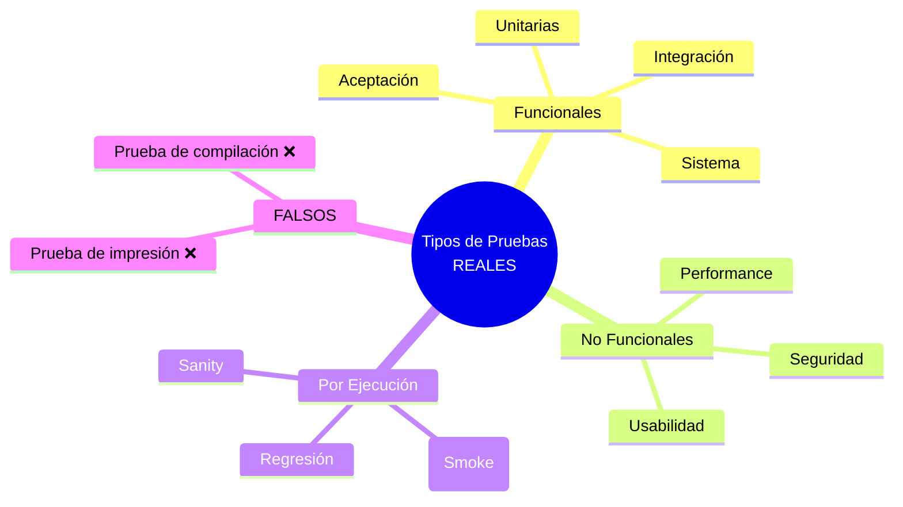
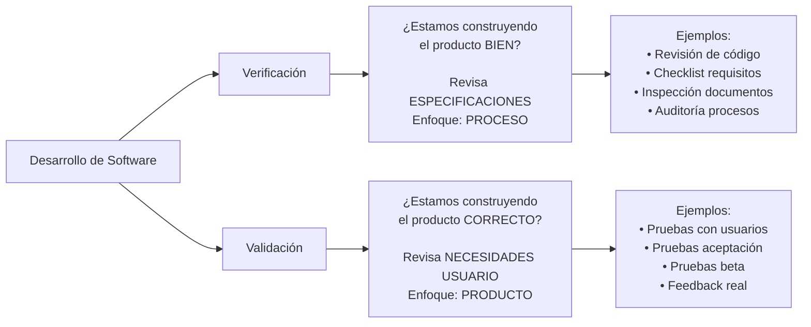

# Clase 01 - Semana 03: Repaso Intensivo para Evaluación 1

- **Unidad 01:** Calidad y Testing de Software
- **Fecha:** Lunes 25 de Agosto, 2025
- **Horario:** 15:50 - 18:10 (140 minutos)
- **Docente:** Diego Obando

## 🎯 Objetivos de la Clase

Al finalizar esta clase de repaso serás capaz de:

- **Dominar** los conceptos fundamentales de testing y calidad que aparecen en la evaluación
- **Distinguir** claramente entre verificación y validación con ejemplos prácticos
- **Identificar** tipos de pruebas y sus aplicaciones específicas
- **Aplicar** conocimientos de Jest y análisis de código de testing
- **Resolver** ejercicios similares a los que aparecerán en la evaluación del miércoles

---

## 📚 Estructura de la Clase (140 minutos)

### 🔥 Bloque 1: Testing Fundamentals + Quiz Express (35 minutos)

- **Duración:** 35 minutos
- **Modalidad:** Repaso interactivo + Quiz grupal
- **Enfoque:** Conceptos fundamentales, tipos de pruebas, consecuencias

### 🧪 Bloque 2: Verificación vs Validación + Casos Prácticos (35 minutos)

- **Duración:** 35 minutos
- **Modalidad:** Casos de estudio + Ejercicios grupales
- **Enfoque:** Diferencias clave, ejemplos, aplicación práctica

### 📏 Bloque 3: Estándares ISO + Jest Hands-on (35 minutos)

- **Duración:** 35 minutos
- **Modalidad:** Repaso teórico + Práctica con código
- **Enfoque:** ISO/IEC 25010, Jest, análisis de código

### 🎯 Bloque 4: Simulacro de Evaluación (35 minutos)

- **Duración:** 35 minutos
- **Modalidad:** Práctica de examen + Retroalimentación
- **Enfoque:** Preguntas tipo evaluación, resolución, tips

---

# 🔥 Bloque 1: Testing Fundamentals + Quiz Express (35 minutos)

## 🎯 Objetivos del Bloque

- Repasar conceptos fundamentales de testing
- Identificar tipos de pruebas correctos vs incorrectos
- Comprender objetivos y consecuencias del testing

## 📖 Repaso Rápido: Conceptos Clave

### 1. ¿Qué es Testing de Software?

> **Definición Clave:** El testing es el proceso de evaluar y verificar que una aplicación de software hace lo que se supone que debe hacer.

**📋 Objetivos principales del testing:**

- ✅ **Detectar defectos ANTES de la entrega**
- ✅ Verificar que el software cumple requisitos
- ✅ Mejorar la calidad del producto
- ✅ Ganar confianza en el software
- ✅ Prevenir defectos futuros

**❌ Lo que NO es objetivo del testing:**

- ❌ Aumentar velocidad del hardware
- ❌ Reducir tamaño del código
- ❌ Mejorar solo la interfaz gráfica

### 2. Tipos de Pruebas - ¡Memoriza estos!



**🎯 Para la evaluación recuerda:**

| ✅ Tipos REALES       | ❌ Tipos FALSOS           |
| --------------------- | ------------------------- |
| Prueba de integración | Prueba de impresión       |
| Prueba de humo        | Prueba de compilación     |
| Prueba de regresión   | Prueba de instalación\*   |
| Prueba unitaria       | Prueba de documentación\* |
| Prueba de aceptación  | Prueba de backup\*        |

\*Aunque estos procesos existen, no son "tipos de prueba" estándar en testing

### 3. Consecuencias del Testing Insuficiente

**💰 Impacto empresarial:**

- Pérdida de clientes y reputación
- Costos de corrección 10x más altos en producción
- Problemas legales en casos críticos
- Pérdida de confianza del mercado

**👥 Impacto en usuarios:**

- Experiencia frustrante
- Pérdida de datos importantes
- Problemas de seguridad
- Abandono de la aplicación

## 🎮 Quiz Express Grupal (15 minutos)

**Instrucciones:** Grupos de 4 personas, 30 segundos por respuesta

### Pregunta 1

**¿Cuál es el objetivo PRINCIPAL del testing?**

- A) Mejorar la velocidad
- B) Detectar defectos antes de entrega ✅
- C) Reducir código
- D) Cambiar la UI

### Pregunta 2

**¿Cuál NO es un tipo de prueba real?**

- A) Integración
- B) Humo
- C) Impresión ✅
- D) Regresión

### Pregunta 3

**¿Qué pasa si no haces testing suficiente?**

- A) El código es más rápido
- B) Los usuarios están más felices
- C) Pierdes clientes y reputación ✅
- D) Ahorras tiempo

### Pregunta 4

**¿Cuándo es mejor encontrar un bug?**

- A) En producción
- B) Durante desarrollo ✅
- C) Después del lanzamiento
- D) Nunca

### Pregunta 5

**¿Por qué automatizar pruebas?**

- A) Es más lento
- B) Más repetible y rápido ✅
- C) Más caro
- D) Más difícil

## 💡 Tips para la Evaluación

**🔍 Palabras clave que buscar:**

- "Objetivo principal" → Detectar defectos
- "NO es tipo de prueba" → Busca cosas raras como "impresión"
- "Consecuencia de no testing" → Problemas con usuarios/costos
- "Ventaja de automatización" → Velocidad y repetibilidad

---

# 🧪 Bloque 2: Verificación vs Validación + Casos Prácticos (35 minutos)

## 🎯 Objetivos del Bloque

- Dominar la diferencia entre verificación y validación
- Aplicar conceptos a casos prácticos
- Resolver ejercicios tipo evaluación

## 📖 Verificación vs Validación - LA CLAVE DEL EXAMEN

### 🔍 Definiciones Precisas



### 📝 Fórmula para Recordar

**VERIFICACIÓN = "¿Estamos haciéndolo BIEN?"**

- Revisa si cumple **especificaciones técnicas**
- Se hace **SIN el usuario final**
- Enfoque en **proceso y documentos**

**VALIDACIÓN = "¿Estamos haciendo lo CORRECTO?"**

- Revisa si cumple **necesidades reales del usuario**
- Se hace **CON el usuario final**
- Enfoque en **producto final y satisfacción**

## 🎯 Casos Prácticos para Resolver

### Caso 1: App de Delivery

**Escenario:** Desarrollaste una app para pedir comida a domicilio

**Pregunta:** Clasifica estas actividades como Verificación (V) o Validación (Va):

| Actividad                                                      | V/Va   | ¿Por qué?                     |
| -------------------------------------------------------------- | ------ | ----------------------------- |
| Revisar que el botón "Pedir" esté en color azul según diseño   | **V**  | Cumple especificación técnica |
| Probar con 10 usuarios reales si pueden completar un pedido    | **Va** | Valida necesidad del usuario  |
| Verificar que la API retorna JSON válido                       | **V**  | Cumple especificación técnica |
| Preguntar si los usuarios están satisfechos con la experiencia | **Va** | Valida satisfacción real      |

### Caso 2: Sistema Bancario

**Escenario:** Sistema para transferencias bancarias

**Ejercicio:** Crea 2 ejemplos de verificación y 2 de validación

**Verificación:**

1. ***
2. ***

**Validación:**

1. ***
2. ***

**💡 Respuestas sugeridas:**

- **Verificación:** Revisar que el algoritmo de encriptación sea SHA-256 según especificación / Auditar que el código siga estándares de codificación
- **Validación:** Probar con clientes reales si el proceso de transferencia es intuitivo / Validar que los usuarios se sienten seguros usando el sistema

## 🎮 Ejercicio Grupal: "Verificación vs Validación Race"

**Instrucciones:** Equipos de 4, 2 minutos por caso

### Caso A: Netflix

"Verificar que el video se reproduce en resolución 4K según especificaciones vs Validar que los usuarios disfrutan la experiencia de streaming"

### Caso B: WhatsApp

"Verificar que los mensajes se envían en menos de 100ms vs Validar que la comunicación entre familiares es efectiva"

### Caso C: Uber

"Verificar que el GPS calcula rutas según algoritmo específico vs Validar que los usuarios llegan rápido a su destino"

## 📋 Template para la Evaluación

**Cuando te pregunten por Verificación vs Validación:**

```

VERIFICACIÓN:

- Definición: Revisa si el software cumple con las especificaciones técnicas establecidas
- Enfoque: Proceso interno, documentos, código
- Ejemplo: [Dar ejemplo técnico específico]

VALIDACIÓN:

- Definición: Verifica que el software satisface las necesidades reales del usuario final
- Enfoque: Producto final, experiencia de usuario
- Ejemplo: [Dar ejemplo con usuarios reales]

```

---

# 📏 Bloque 3: Estándares ISO + Jest Hands-on (35 minutos)

## 🎯 Objetivos del Bloque

- Repasar importancia de estándares ISO/IEC 25010
- Practicar análisis de código Jest
- Resolver ejercicios de testing automatizado

## 📖 Estándares ISO - Lo Esencial para la Evaluación

### 🏛️ ISO/IEC 25010 - ¿Qué es?

**Definición para el examen:**

> ISO/IEC 25010 es un estándar internacional que define las **características de calidad del software** y proporciona un marco para evaluar la calidad de productos de software.

### 🎯 ¿Por qué son importantes los estándares ISO?

| Beneficio               | Explicación                               | Ejemplo                                                      |
| ----------------------- | ----------------------------------------- | ------------------------------------------------------------ |
| **Comunicación común**  | Todos hablan el mismo "idioma" de calidad | Cliente y desarrollador entienden qué significa "usabilidad" |
| **Calidad garantizada** | Marcos probados internacionalmente        | Software más confiable y predecible                          |
| **Confianza**           | Respaldo de organizaciones reconocidas    | Clientes confían más en software certificado                 |
| **Competitividad**      | Diferenciación en el mercado              | "Software cumple estándares ISO"                             |

### 💡 Respuesta Tipo para la Evaluación

**Pregunta:** "¿Por qué es importante seguir estándares ISO en desarrollo de software?"

**Respuesta modelo:**

```

Los estándares ISO son importantes porque:

1. COMUNICACIÓN: Facilitan un lenguaje común entre equipos, clientes y proveedores
   para hablar de calidad de manera objetiva.

2. CALIDAD: Proporcionan marcos probados internacionalmente que ayudan a
   desarrollar software más confiable y de mayor calidad.

3. CONFIANZA: Generan confianza en clientes y stakeholders al seguir
   estándares reconocidos mundialmente.

Ejemplo: Un cliente que pide software "usable" puede estar seguro de que
cumple criterios internacionales específicos según ISO/IEC 25010.

```

## 🧪 Jest Hands-on - Análisis de Código

### 🔍 Análisis de Test Básico

**Código para analizar:**

```javascript
test("suma dos números", () => {
  const resultado = suma(2, 3);
  expect(resultado).toBe(5);
});
```

### 📋 Preguntas Tipo Evaluación

**1. ¿Qué está probando este test?**

```
Respuesta: Este test está probando que la función 'suma' devuelve
el resultado correcto (5) al sumar dos números enteros positivos (2 + 3).
```

**2. ¿Por qué es útil automatizar este tipo de pruebas?**

```
Respuesta: Es útil porque:
- VELOCIDAD: Se ejecuta automáticamente en segundos
- REPETIBILIDAD: Mismo test se puede ejecutar miles de veces
- DETECCIÓN TEMPRANA: Encuentra errores inmediatamente al cambiar código
- CONFIANZA: Permite modificar código sabiendo que no rompe funcionalidad
```

**3. ¿Qué mejoras podrías agregar a este test?**

```
Mejoras sugeridas:
- Probar números negativos: suma(-1, -2) debería ser -3
- Probar con cero: suma(0, 5) debería ser 5
- Probar decimales: suma(0.1, 0.2) debería ser aproximadamente 0.3
- Probar números grandes: suma(999999, 1) debería ser 1000000
```

### 🎮 Ejercicio Práctico: Análisis de Test Complejo

```javascript
describe("Calculadora", () => {
  test("división normal", () => {
    expect(division(10, 2)).toBe(5);
  });

  test("división por cero", () => {
    expect(() => division(10, 0)).toThrow("No se puede dividir por cero");
  });
});
```

**Preguntas:**

1. **¿Cuántos tests hay?** **\*\***\_\_\_**\*\***
2. **¿Qué prueba el primer test?** **\*\***\_\_\_**\*\***
3. **¿Qué prueba el segundo test?** **\*\***\_\_\_**\*\***
4. **¿Por qué es importante probar división por cero?** **\*\***\_\_\_**\*\***

**💡 Respuestas:**

1. Hay 2 tests
2. Que la función división retorna el resultado correcto para números válidos
3. Que la función lanza un error apropiado cuando se divide por cero
4. Porque es un caso límite que puede crashear la aplicación si no se maneja correctamente

## 🎯 Jest - Conceptos Clave para la Evaluación

### ¿Qué es Jest?

> Jest es un **framework de testing** para JavaScript que permite realizar **pruebas automatizadas** de forma rápida y sencilla.

### Ventajas de Jest:

- **Fácil de usar:** Sintaxis intuitiva
- **Rápido:** Ejecuta tests en paralelo
- **Completo:** Incluye assertions, mocks, coverage
- **Popular:** Usado por Facebook, Netflix, etc.

---

# 🎯 Bloque 4: Simulacro de Evaluación (35 minutos)

## 🎯 Objetivos del Bloque

- Practicar con preguntas tipo evaluación real
- Recibir retroalimentación inmediata
- Identificar áreas de mejora antes del miércoles

## 📝 Simulacro - Sección I: Selección Múltiple

**Tiempo límite: 10 minutos (2 minutos por pregunta)**

### Pregunta 1

¿Cuál de los siguientes es un objetivo principal del testing de software?

- a) Aumentar la velocidad del hardware
- b) Detectar defectos antes de la entrega
- c) Reducir el tamaño del código fuente
- d) Mejorar solo la interfaz gráfica

**💡 Tip:** Busca la opción que habla de **prevenir problemas** antes de que lleguen al usuario.

### Pregunta 2

¿Qué herramienta se utiliza para realizar pruebas automatizadas en JavaScript?

- a) GitHub
- b) Jest
- c) Docker
- d) Visual Studio Code

**💡 Tip:** Busca herramientas **específicas de testing**, no herramientas generales de desarrollo.

### Pregunta 3

¿Cuál es la diferencia principal entre verificación y validación?

- a) Verificación es después de validación
- b) Verificación revisa especificaciones, validación revisa necesidades del usuario
- c) Son exactamente lo mismo
- d) Validación es solo para hardware

**💡 Tip:** Recuerda "Verificación = especificaciones técnicas, Validación = necesidades usuario"

### Pregunta 4

¿Cuál de los siguientes NO es un tipo de prueba de software estándar?

- a) Prueba de integración
- b) Prueba de humo
- c) Prueba de impresión
- d) Prueba de regresión

**💡 Tip:** Busca la opción que suene "rara" o no relacionada con testing.

### Pregunta 5

¿Por qué es importante seguir estándares como ISO/IEC 25010?

- a) Solo para parecer más profesionales
- b) Facilitan comunicación común y garantizan calidad
- c) Son obligatorios por ley
- d) Hacen que el código sea más rápido

**💡 Tip:** Los estándares son sobre **comunicación, calidad y confianza**.

## 📝 Simulacro - Sección II: Verdadero o Falso

**Tiempo límite: 5 minutos**

1. **(V/F)** El testing de software solo se realiza al final del desarrollo.
2. **(V/F)** Las pruebas automatizadas ayudan a detectar errores más rápido.
3. **(V/F)** La validación verifica que el software cumpla con especificaciones técnicas.
4. **(V/F)** Jest es una herramienta para testing automatizado en JavaScript.
5. **(V/F)** Un software puede tener calidad aunque tenga algunos errores menores.

## 📝 Simulacro - Sección III: Desarrollo Corto

**Tiempo límite: 15 minutos (5 min por pregunta)**

### Pregunta 1

Explica la diferencia entre verificación y validación con un ejemplo de cada una.

**📝 Espacio para respuesta:**

```
VERIFICACIÓN:
Definición: ________________________________
Ejemplo: ___________________________________

VALIDACIÓN:
Definición: ________________________________
Ejemplo: ___________________________________
```

### Pregunta 2

Una app de delivery tiene problemas: se cierra inesperadamente y pierde pedidos.

a) ¿Qué consecuencias puede tener no hacer testing adecuado?

```
_________________________________________________
_________________________________________________
```

b) ¿Qué tipos de pruebas podrían haber evitado estos problemas?

```
_________________________________________________
_________________________________________________
```

### Pregunta 3

¿Por qué son importantes los estándares ISO en desarrollo de software? (Menciona 2 beneficios)

```
Beneficio 1: _________________________________
Beneficio 2: _________________________________
```

## 📝 Simulacro - Sección IV: Análisis de Código Jest

**Tiempo límite: 5 minutos**

```javascript
test("multiplicación de números", () => {
  const resultado = multiplicar(4, 5);
  expect(resultado).toBe(20);
});
```

**Preguntas:**

1. ¿Qué está probando este test?

```
_________________________________________________
```

2. ¿Por qué es útil automatizar estas pruebas?

```
_________________________________________________
```

3. ¿Qué mejora agregarías?

```
_________________________________________________
```

## 🔍 Retroalimentación y Respuestas

### Respuestas Selección Múltiple:

1. **b) Detectar defectos antes de la entrega**
2. **b) Jest**
3. **b) Verificación revisa especificaciones, validación revisa necesidades del usuario**
4. **c) Prueba de impresión**
5. **b) Facilitan comunicación común y garantizan calidad**

### Respuestas Verdadero/Falso:

1. **F** (se hace durante todo el desarrollo)
2. **V**
3. **F** (validación revisa necesidades del usuario, verificación las especificaciones)
4. **V**
5. **V**

## 🎯 Tips Finales para el Miércoles

### ⏰ Estrategia de Tiempo:

- **Selección múltiple:** 15-20 minutos máximo
- **V/F:** 5-8 minutos
- **Desarrollo corto:** 20-25 minutos
- **Análisis código:** 10-15 minutos
- **Revisión:** 10 minutos

### 🧠 Técnicas de Examen:

1. **Lee TODO** antes de empezar
2. **Responde fáciles primero**
3. **Marca palabras clave** en desarrollo
4. **Usa ejemplos específicos**
5. **Revisa respuestas** si tienes tiempo

### 📋 Checklist Final:

- [ ] ¿Sé la diferencia entre verificación y validación?
- [ ] ¿Puedo nombrar 4 tipos de pruebas reales?
- [ ] ¿Sé qué es Jest y para qué sirve?
- [ ] ¿Puedo explicar 2 beneficios de estándares ISO?
- [ ] ¿Puedo analizar código de test simple?

## 🎊 ¡Estás Listo!

### 📚 Para estudiar esta noche:

- Repasa **verificación vs validación** con ejemplos
- Memoriza **tipos de pruebas** (integración, humo, regresión, unitarias)
- Practica **análisis de código Jest**
- Revisa **beneficios de estándares ISO**

### 💪 ¡Confianza!

Has visto todo el contenido, has practicado, tienes las herramientas. **¡Vas a hacer un examen excelente!**

**¡Nos vemos el miércoles! 🚀**
