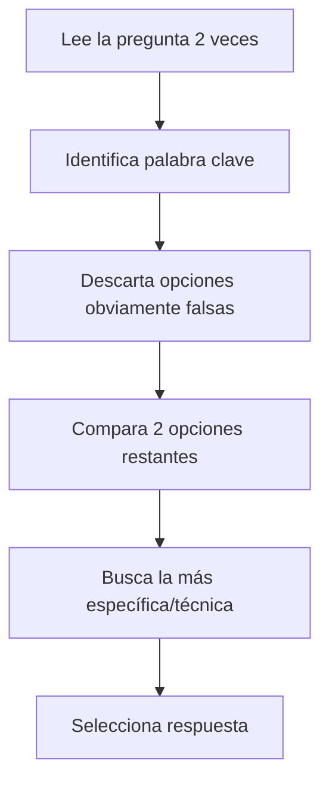

# Clase 02 - Semana 03: Repaso Final - Ejercicios y Simulacro Pre-Evaluación

- **Unidad 01:** Calidad y Testing de Software
- **Fecha:** Martes 26 de Agosto, 2025
- **Horario:** 15:50 - 18:10 (140 minutos)
- **Docente:** Diego Obando

## 🎯 Objetivos de la Clase

Al finalizar esta clase final de repaso serás capaz de:

- **Resolver** con confianza todos los tipos de preguntas de la evaluación
- **Aplicar** estrategias específicas para cada sección del examen
- **Identificar** y corregir errores comunes en respuestas
- **Manejar** el tiempo efectivamente durante la evaluación
- **Sentirte completamente preparado** para la evaluación del miércoles

---

## 📚 Estructura de la Clase (140 minutos)

### 🎯 Bloque 1: Ejercicios de Selección Múltiple + Verdadero/Falso (35 minutos)

- **Duración:** 35 minutos
- **Modalidad:** Práctica intensiva + Técnicas de descarte
- **Enfoque:** Resolución rápida, trucos para identificar respuestas

### 🧠 Bloque 2: Desarrollo Corto - Técnicas y Práctica (35 minutos)

- **Duración:** 35 minutos
- **Modalidad:** Ejercicios de redacción + Feedback grupal
- **Enfoque:** Estructurar respuestas, ejemplos efectivos

### 💻 Bloque 3: Jest y Casos Prácticos Avanzados (35 minutos)

- **Duración:** 35 minutos
- **Modalidad:** Análisis de código + Diseño de pruebas
- **Enfoque:** Interpretación de tests, mejoras, planificación

### ⚡ Bloque 4: Simulacro Final + Estrategias de Examen (35 minutos)

- **Duración:** 35 minutos
- **Modalidad:** Examen simulado completo + Tips finales
- **Enfoque:** Condiciones reales, manejo de tiempo, confianza

---

# 🎯 Bloque 1: Ejercicios de Selección Múltiple + Verdadero/Falso (35 minutos)

## 🎯 Objetivos del Bloque

- Dominar técnicas de descarte para selección múltiple
- Practicar identificación rápida de respuestas verdadero/falso
- Desarrollar intuición para reconocer respuestas correctas

## 🧠 Técnicas de Resolución - Selección Múltiple

### 🔍 Método de Descarte Sistemático



### 🎯 Palabras Clave por Tema

| Tema                        | Palabras que BUSCAR ✅                    | Palabras que EVITAR ❌                    |
| --------------------------- | ----------------------------------------- | ----------------------------------------- |
| **Testing**                 | "defectos", "antes de entrega", "calidad" | "velocidad", "hardware", "UI únicamente"  |
| **Herramientas**            | "Jest", "automatizadas", "JavaScript"     | "GitHub", "Docker", "Visual Studio"       |
| **Verificación/Validación** | "especificaciones", "necesidades usuario" | "son lo mismo", "validación después"      |
| **ISO**                     | "estándares", "comunicación", "confianza" | "obligatorio por ley", "solo profesional" |
| **Tipos de Prueba**         | "integración", "humo", "regresión"        | "impresión", "compilación", "backup"      |

## 🎮 Práctica Intensiva - Selección Múltiple

**⏱️ Límite: 2 minutos por pregunta**

### Batería A: Conceptos Fundamentales

**1. El objetivo MÁS IMPORTANTE del testing de software es:**

- a) Hacer que el software sea más rápido
- b) Detectar y prevenir defectos antes de la entrega al usuario
- c) Reducir la cantidad de código escrito
- d) Mejorar únicamente la apariencia visual

**🧠 Análisis:**

- Palabra clave: "MÁS IMPORTANTE"
- Descarte: a) velocidad ❌, c) cantidad código ❌, d) solo visual ❌
- **Respuesta: b)** ✅

**2. ¿Cuál de estas herramientas es específica para testing automatizado en JavaScript?**

- a) Git para control de versiones
- b) Jest para pruebas automatizadas
- c) Docker para contenedores
- d) Slack para comunicación

**🧠 Análisis:**

- Palabra clave: "testing automatizado JavaScript"
- Solo Jest es herramienta de testing ✅
- **Respuesta: b)** ✅

**3. La principal diferencia entre verificación y validación es:**

- a) Verificación se hace después que validación
- b) Verificación revisa especificaciones, validación revisa satisfacción del usuario
- c) Son términos sinónimos que significan lo mismo
- d) Validación solo se aplica a hardware

**🧠 Análisis:**

- Recordar: Verificación = BIEN (especificaciones), Validación = CORRECTO (usuario)
- **Respuesta: b)** ✅

### Batería B: Aplicación Práctica

**4. Una empresa lanza software sin testing suficiente. La consecuencia MÁS PROBABLE es:**

- a) El software funcionará perfectamente
- b) Los usuarios tendrán una mala experiencia y la empresa perderá reputación
- c) El software será más rápido
- d) Se reducirán los costos de mantenimiento

**5. ¿Cuál NO es un tipo estándar de prueba de software?**

- a) Prueba de integración entre módulos
- b) Prueba de humo para verificación básica
- c) Prueba de impresión de documentos
- d) Prueba de regresión tras cambios

## ⚡ Técnicas para Verdadero/Falso

### 🎯 Estrategias de Identificación

| Indicador                                                 | V/F Probable | Ejemplo                                         |
| --------------------------------------------------------- | ------------ | ----------------------------------------------- |
| **Palabras absolutas** ("solo", "nunca", "siempre")       | F            | "Testing SOLO se hace al final"                 |
| **Palabras moderadas** ("ayuda", "puede", "generalmente") | V            | "Tests automatizados AYUDAN a detectar errores" |
| **Conceptos básicos correctos**                           | V            | "Jest es para testing en JavaScript"            |
| **Conceptos invertidos**                                  | F            | "Validación revisa especificaciones técnicas"   |

## 🎮 Práctica V/F - Sprint de 30 segundos

**⏱️ 30 segundos por respuesta:**

1. **(V/F)** Testing de software SOLO se debe hacer al final del desarrollo
2. **(V/F)** Las pruebas automatizadas PUEDEN ayudar a detectar errores más rápido
3. **(V/F)** Verificación revisa si cumple especificaciones técnicas
4. **(V/F)** TODOS los software deben tener 100% cobertura de testing
5. **(V/F)** Jest es una herramienta para testing automatizado
6. **(V/F)** Validación se enfoca en satisfacción del usuario final
7. **(V/F)** Es IMPOSIBLE tener software de calidad con algunos errores menores
8. **(V/F)** ISO/IEC 25010 define características de calidad de software

**🎯 Respuestas rápidas:**

1. F (absoluta "SOLO") | 2. V (moderada "PUEDEN") | 3. V (concepto correcto) | 4. F (absoluta "TODOS") | 5. V (hecho) | 6. V (concepto correcto) | 7. F (absoluta "IMPOSIBLE") | 8. V (hecho)

---

# 🧠 Bloque 2: Desarrollo Corto - Técnicas y Práctica (35 minutos)

## 🎯 Objetivos del Bloque

- Dominar estructura de respuestas para desarrollo corto
- Practicar redacción clara y concisa
- Usar ejemplos efectivos que demuestren comprensión

## 📝 Estructura Ganadora para Desarrollo Corto

### 🏗️ Template de Respuesta Efectiva

```
TEMA: [Concepto principal]

DEFINICIÓN: [1-2 oraciones claras]

DIFERENCIA/CARACTERÍSTICAS: [Puntos específicos]

EJEMPLO CONCRETO: [Situación real que ilustre el concepto]

CONCLUSIÓN: [Por qué es importante]
```

### 🎯 Fórmula de Oro: "DEK-E-C"

- **D**efinición clara
- **E**specificidad técnica
- **C**omparación cuando corresponda
- **E**jemplo concreto
- **C**onclusión del valor

## 🎮 Ejercicio Intensivo: Verificación vs Validación

### Pregunta Tipo Evaluación:

**"Explica la diferencia entre verificación y validación con un ejemplo de cada una"**

### 📝 Respuesta Modelo:

```
VERIFICACIÓN VS VALIDACIÓN

VERIFICACIÓN:
- Definición: Proceso que revisa si el software cumple con las
  especificaciones técnicas y requisitos establecidos
- Enfoque: "¿Estamos construyendo el producto BIEN?"
- Se realiza SIN el usuario final
- Ejemplo: Revisar que el botón de login tenga color azul según
  el documento de diseño, o auditar que el código siga los
  estándares de programación establecidos

VALIDACIÓN:
- Definición: Proceso que verifica si el software satisface las
  necesidades reales del usuario final
- Enfoque: "¿Estamos construyendo el producto CORRECTO?"
- Se realiza CON el usuario final
- Ejemplo: Probar con usuarios reales si pueden completar el
  proceso de login exitosamente y si se sienten cómodos
  usando la interfaz

IMPORTANCIA: Ambos procesos son complementarios y esenciales
para garantizar software de calidad tanto técnica como práctica.
```

## 🎯 Práctica Guiada: Casos Empresariales

### Caso 1: Netflix con Problemas

**Pregunta:** "Una plataforma de streaming lanza sin testing adecuado y los usuarios reportan videos que no cargan y pagos que fallan."

**a) ¿Qué consecuencias puede tener para la empresa?**
**b) ¿Qué tipos de pruebas podrían haber evitado estos problemas?**

### 📝 Respuesta Estructura:

**a) CONSECUENCIAS:**

```
IMPACTO COMERCIAL:
- Pérdida masiva de usuarios y cancelación de suscripciones
- Daño severo a la reputación de la marca
- Costos altos de corrección en producción (10x más costoso)

IMPACTO OPERATIVO:
- Pérdida de confianza de inversionistas
- Posibles demandas por servicios pagados no entregados
- Sobrecarga del equipo técnico en modo crisis

EJEMPLO REAL: Como cuando Facebook estuvo caído 6 horas
en 2021 y perdió millones de dólares por hora.
```

**b) TIPOS DE PRUEBAS:**

```
PARA VIDEOS QUE NO CARGAN:
- Pruebas de integración entre frontend y backend
- Pruebas de performance bajo carga de usuarios
- Pruebas de compatibilidad en diferentes dispositivos

PARA PAGOS QUE FALLAN:
- Pruebas de integración con pasarelas de pago
- Pruebas de seguridad en transacciones
- Pruebas de regresión tras actualizaciones del sistema

PREVENTIVAS:
- Pruebas de humo antes de cada deploy
- Pruebas automatizadas en CI/CD pipeline
```

## 🎮 Ejercicios de Práctica Individual

### Ejercicio A: Estándares ISO

**"¿Por qué son importantes los estándares ISO en desarrollo de software? Menciona dos beneficios específicos"**

**⏱️ Tiempo: 5 minutos**

**📝 Tu respuesta:**

```
IMPORTANCIA DE ESTÁNDARES ISO:

BENEFICIO 1:
_________________________________________________

BENEFICIO 2:
_________________________________________________

EJEMPLO ESPECÍFICO:
_________________________________________________
```

### Ejercicio B: Testing Insuficiente

**"Una app móvil de delivery se lanza sin pruebas suficientes. Los usuarios reportan que pierden pedidos y la app se cierra inesperadamente. Analiza las consecuencias."**

**⏱️ Tiempo: 5 minutos**

**📝 Tu respuesta:**

```
CONSECUENCIAS PARA LA EMPRESA:
_________________________________________________

CONSECUENCIAS PARA USUARIOS:
_________________________________________________

TIPOS DE PRUEBAS NECESARIAS:
_________________________________________________
```

## 💡 Tips de Redacción para Desarrollo

### ✅ Frases que Suman Puntos:

- "Por ejemplo, en una aplicación de..."
- "Esto se debe a que..."
- "La importancia radica en..."
- "En el contexto empresarial..."
- "Como resultado de esto..."

### ❌ Errores que Restan Puntos:

- Respuestas genéricas sin ejemplos
- Definiciones circulares ("Testing es testear")
- Confundir conceptos básicos
- No responder completamente la pregunta
- Ejemplos irrelevantes o incorrectos

---

# 💻 Bloque 3: Jest y Casos Prácticos Avanzados (35 minutos)

## 🎯 Objetivos del Bloque

- Dominar análisis de código Jest complejo
- Diseñar mejoras específicas para tests
- Crear planes de prueba para aplicaciones reales

## 🧪 Análisis de Jest - Nivel Avanzado

### 🔍 Código Complejo para Analizar

```javascript
describe("Sistema de Autenticación", () => {
  test("login exitoso con credenciales válidas", () => {
    const usuario = { email: "test@test.com", password: "123456" };
    const resultado = login(usuario.email, usuario.password);

    expect(resultado.success).toBe(true);
    expect(resultado.token).toBeDefined();
    expect(resultado.user.email).toBe("test@test.com");
  });

  test("login falla con password incorrecto", () => {
    const resultado = login("test@test.com", "passwordMalo");

    expect(resultado.success).toBe(false);
    expect(resultado.error).toBe("Credenciales inválidas");
    expect(resultado.token).toBeUndefined();
  });

  test("login falla con email vacío", () => {
    expect(() => {
      login("", "123456");
    }).toThrow("Email requerido");
  });
});
```

## 📋 Preguntas de Análisis Avanzado

### 1. Análisis Detallado (Tipo evaluación)

**a) ¿Cuántos tests contiene este código y qué prueba cada uno?**

```
TEST 1: _______________________________________________
Función: ______________________________________________

TEST 2: _______________________________________________
Función: ______________________________________________

TEST 3: _______________________________________________
Función: ______________________________________________
```

**b) ¿Por qué es importante probar tanto casos exitosos como fallidos?**

```
CASOS EXITOSOS:
___________________________________________________

CASOS FALLIDOS:
___________________________________________________

IMPORTANCIA GENERAL:
___________________________________________________
```

### 2. Mejoras y Extensiones

**c) ¿Qué 3 mejoras o tests adicionales agregarías?**

```
MEJORA 1: _________________________________________
¿Por qué?: _______________________________________

MEJORA 2: _________________________________________
¿Por qué?: _______________________________________

MEJORA 3: _________________________________________
¿Por qué?: _______________________________________
```

## 💡 Respuestas Modelo

### Análisis Detallado:

```
TEST 1: "login exitoso con credenciales válidas"
Función: Verifica que el login funciona correctamente con
datos válidos y retorna token + información de usuario

TEST 2: "login falla con password incorrecto"
Función: Verifica que el sistema rechaza correctamente
credenciales inválidas y maneja el error apropiadamente

TEST 3: "login falla con email vacío"
Función: Verifica que el sistema valida entrada y lanza
excepción apropiada para datos faltantes
```

### Importancia de Casos Exitosos/Fallidos:

```
CASOS EXITOSOS: Confirman que la funcionalidad principal
trabaja como se espera bajo condiciones normales

CASOS FALLIDOS: Aseguran que el sistema maneja errores
graciosamente sin crashear o exponer información sensible

IMPORTANCIA GENERAL: Software robusto debe manejar tanto
flujos normales como excepcionales de manera predecible
```

## 🎯 Diseño de Plan de Pruebas - Ejercicio Práctico

### Escenario: E-commerce Básico

**"Diseña un plan de pruebas para un carrito de compras que permite agregar productos, modificar cantidades y calcular total"**

### 📋 Template de Plan de Pruebas

| Caso de Prueba | Descripción             | Entrada                        | Resultado Esperado  | Prioridad |
| -------------- | ----------------------- | ------------------------------ | ------------------- | --------- |
| TC001          | Agregar producto válido | Producto existente, cantidad 1 | Producto en carrito | Alta      |
| TC002          |                         |                                |                     |           |
| TC003          |                         |                                |                     |           |

### 🎮 Ejercicio Individual (15 minutos)

**Completa el plan de pruebas con al menos 6 casos:**

```
CASOS FUNCIONALES BÁSICOS:
TC001: ____________________________________________
TC002: ____________________________________________
TC003: ____________________________________________

CASOS DE BORDE/ERROR:
TC004: ____________________________________________
TC005: ____________________________________________
TC006: ____________________________________________

CASOS DE INTEGRACIÓN:
TC007: ____________________________________________
TC008: ____________________________________________
```

## 🔧 Jest - Conceptos Avanzados

### 🎯 Matchers Importantes para la Evaluación

| Matcher           | Uso                            | Ejemplo                               |
| ----------------- | ------------------------------ | ------------------------------------- |
| `toBe()`          | Igualdad exacta                | `expect(2+2).toBe(4)`                 |
| `toBeDefined()`   | Variable tiene valor           | `expect(token).toBeDefined()`         |
| `toBeUndefined()` | Variable no tiene valor        | `expect(error).toBeUndefined()`       |
| `toThrow()`       | Función lanza error            | `expect(() => divide(5,0)).toThrow()` |
| `toContain()`     | Array/string contiene elemento | `expect(users).toContain("admin")`    |

### 🧠 Patrón de Naming para Tests

```javascript
// PATRÓN: [Función] + [Condición] + [Resultado esperado]

test("login con credenciales válidas devuelve token", () => {});
test("login con password incorrecto retorna error", () => {});
test("agregar producto con cantidad negativa lanza excepción", () => {});
```

---

# ⚡ Bloque 4: Simulacro Final + Estrategias de Examen (35 minutos)

## 🎯 Objetivos del Bloque

- Simular condiciones exactas del examen
- Aplicar todas las técnicas aprendidas
- Recibir confianza final para mañana

## ⏰ Simulacro Cronometrado - 25 minutos

**Instrucciones:** Resuelve como si fuera la evaluación real

### SECCIÓN I: Selección Múltiple (8 minutos - 4 preguntas)

**1. ¿Cuál es la ventaja PRINCIPAL de las pruebas automatizadas sobre las manuales?**

- a) Son más baratas de desarrollar inicialmente
- b) Pueden ejecutarse repetidamente y detectar errores rápidamente
- c) No requieren conocimiento técnico
- d) Solo funcionan con aplicaciones web

**2. En el contexto de calidad de software, la validación se enfoca en:**

- a) Revisar si el código cumple estándares de programación
- b) Verificar que el software satisface las necesidades reales del usuario
- c) Comprobar que no hay errores de sintaxis
- d) Auditar que la documentación esté completa

**3. ¿Cuál de los siguientes NO es un tipo estándar de prueba de software?**

- a) Prueba de regresión para verificar que cambios no rompan funcionalidad
- b) Prueba de integración entre diferentes módulos del sistema
- c) Prueba de formateo automático de documentos
- d) Prueba de humo para verificación básica del sistema

**4. Los estándares como ISO/IEC 25010 son importantes porque:**

- a) Son obligatorios por ley en todos los países
- b) Facilitan comunicación común sobre calidad y aumentan confianza
- c) Hacen que el software sea automáticamente más rápido
- d) Solo sirven para proyectos gubernamentales

### SECCIÓN II: Verdadero o Falso (3 minutos - 4 preguntas)

**5. (V/F)** Testing de software se debe realizar únicamente al final del desarrollo
**6. (V/F)** Jest es un framework específico para testing automatizado en JavaScript
**7. (V/F)** Verificación revisa si el software cumple con especificaciones técnicas
**8. (V/F)** Software de alta calidad nunca puede tener errores de ningún tipo

### SECCIÓN III: Desarrollo Corto (10 minutos - 2 preguntas)

**9. Explica la diferencia entre verificación y validación. Da un ejemplo específico de cada una aplicado a una app de banca móvil. (5 puntos)**

**10. Una startup lanza una app de redes sociales sin hacer testing suficiente. Los usuarios reportan que la app consume batería excesivamente y a veces borra posts. ¿Qué consecuencias puede tener esto para la empresa y qué tipos de pruebas podrían haber evitado estos problemas? (5 puntos)**

### SECCIÓN IV: Análisis de Código (4 minutos)

**11. Analiza este código Jest:**

```javascript
describe("Calculadora de Descuentos", () => {
  test("aplica 10% descuento a compras mayores a $100", () => {
    const precio = calcularPrecioFinal(150, "cliente_regular");
    expect(precio).toBe(135);
  });

  test("lanza error para descuentos inválidos", () => {
    expect(() => {
      calcularPrecioFinal(100, "tipo_inexistente");
    }).toThrow("Tipo de cliente inválido");
  });
});
```

**a) ¿Qué está probando cada test? (2 puntos)**
**b) ¿Qué mejora o test adicional agregarías y por qué? (3 puntos)**

## ⏰ Tiempo de Corrección (10 minutos)

### 🎯 Respuestas Correctas:

**Selección Múltiple:**

1. b) | 2. b) | 3. c) | 4. b)

**Verdadero/Falso:** 5. F | 6. V | 7. V | 8. F

**Desarrollo - Puntos clave:** 9. Verificación = especificaciones técnicas, Validación = necesidades usuario + ejemplos específicos 10. Consecuencias = pérdida usuarios/reputación, Pruebas = performance, funcionales, usabilidad

**Análisis Código:**
11a. Test1: descuento correcto, Test2: manejo errores
11b. Casos adicionales: sin descuento, límites, diferentes tipos cliente

## 🚀 Estrategias Finales para Mañana

### ⏰ Distribución de Tiempo Recomendada (Total: 90 minutos)

- **Lectura general:** 2-3 minutos
- **Selección múltiple:** 15 minutos máximo
- **Verdadero/Falso:** 8 minutos
- **Desarrollo corto:** 35 minutos (15-20 min cada una)
- **Análisis código:** 15 minutos
- **Revisión:** 15 minutos

### 🧠 Técnicas de Examen

#### Durante el Examen:

1. **Lee TODO primero** - identifica preguntas fáciles
2. **Responde fáciles primero** - genera confianza y ahorra tiempo
3. **Subraya palabras clave** en desarrollo corto
4. **Usa ejemplos específicos** - no genéricos
5. **Revisa respuestas** si tienes tiempo

#### Para Desarrollo Corto:

- **Estructura clara:** Definición → Diferencia → Ejemplo → Conclusión
- **Sé específico:** "App de delivery" mejor que "una aplicación"
- **Completa la respuesta:** Responde todas las partes de la pregunta

#### Para Análisis de Código:

- **Lee el código 2 veces** antes de responder
- **Identifica el patrón:** describe() agrupa, test() verifica
- **Piensa en casos no cubiertos** para mejoras

### 💪 Mentalidad para Mañana

#### 🎯 Mantras de Confianza:

- "He practicado todo el contenido"
- "Domino la diferencia verificación/validación"
- "Puedo analizar código Jest efectivamente"
- "Sé estructurar respuestas de desarrollo"
- "Estoy completamente preparado"

#### 📚 Repaso de Esta Noche (30 minutos máximo):

- **10 min:** Verificación vs Validación con ejemplos
- **10 min:** Tipos de pruebas (reales vs falsos)
- **10 min:** Estructura de respuestas para desarrollo

#### 🛌 Descanso:

- **Duerme bien** - el cerebro necesita descanso
- **Desayuna bien** - energía para pensar claramente
- **Llega 15 minutos antes** - evita estrés innecesario

## 🎊 ¡Estás 100% Preparado!

### ✅ Lo que has logrado en estos dos días:

- ✅ Dominas conceptos fundamentales de testing
- ✅ Distingues perfectamente verificación vs validación
- ✅ Identificas tipos de pruebas reales vs falsos
- ✅ Analizas código Jest efectivamente
- ✅ Estructuras respuestas de desarrollo correctamente
- ✅ Conoces la importancia de estándares ISO
- ✅ Manejas estrategias de tiempo y examen

### 🚀 Mensaje Final:

**Tienes todas las herramientas, conocimiento y confianza necesaria. Mañana vas a demostrar todo lo que has aprendido. ¡Vas a hacer un examen excelente!**

**¡Nos vemos después de la evaluación para celebrar tu éxito! 🎉**

---

### 📋 Checklist Final - Úsala Mañana Antes del Examen:

- [ ] ¿Traje todo lo necesario? (lápiz, goma, calculadora si se permite)
- [ ] ¿Recuerdo la diferencia verificación (BIEN) vs validación (CORRECTO)?
- [ ] ¿Puedo nombrar 4 tipos de pruebas reales?
- [ ] ¿Sé qué es Jest y sus ventajas?
- [ ] ¿Recuerdo 2 beneficios de estándares ISO?
- [ ] ¿Estoy relajado y confiado?

**¡SÍ A TODO! ¡VAMOS! 🚀**
